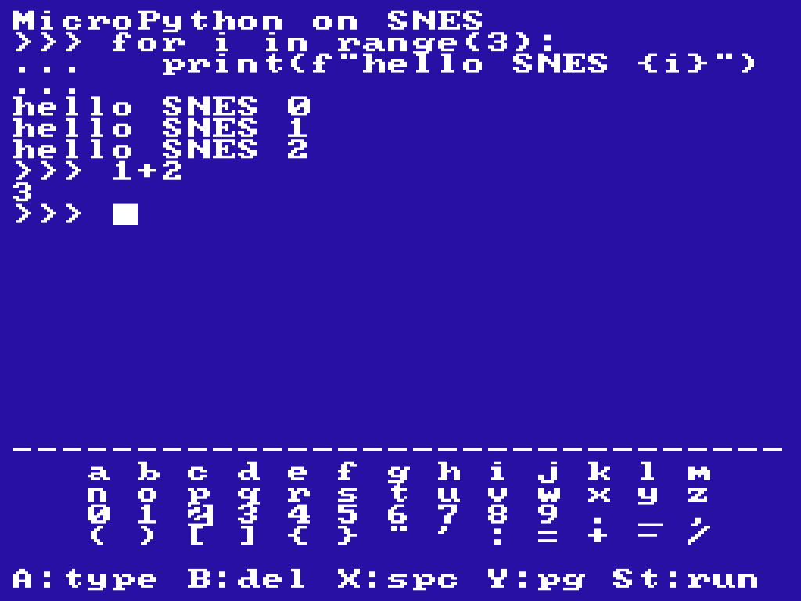
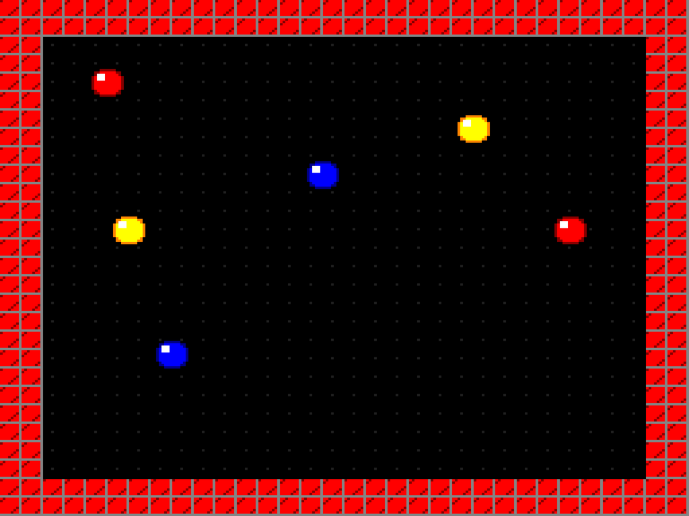

# 超级任天堂上的 MicroPython

翻译整理自：[A Fable of Python on the Super Nintendo](https://fabian-kuebler.com/posts/fable-python-snes/)

Python on the SNES 一直是我长久以来的梦想。小时候我和哥哥共享一个SNES，而 Python 是我职业生涯中很大一部分的重要职业。如今我几乎不再接触代码了，所以这个梦想在某种程度上失去了相关性。然后 Claude Fable 5 问世了，我想：这将为该模型提供一个很好的基准。将 MicroPython 移植到 SNES：3.58 MHz CPU、128 KB RAM、16位int 和一个[小众C编译器](https://www.calypsi.cc/)。这可能几乎是不可能的。

所以在 Fable 发布的第一天我就开始了。到晚上它已经构建了一个hello world ROM，一个编译器自检，已经发现了两个真正的编译器错误，以及 MicroPython 在 SNES 上的所有内核编译和启动。

第二天早上醒来，我期待着继续，却发现 Fable 从模型库消失了 …… 出口禁令。我继续使用 Opus 4.8，但无济于事：任何 Python 都会因垃圾回收错误死亡，每次构建都会出现故障，经过一天的精心工作，Opus得出结论，该项目陷入了困境。它停滞了三个星期。

现在，Fable 5再次可用。我给了它五个字——“Please make shit work now!”（让狗屎工作！）——它做到了。距离实际bug还有90分钟；当天晚餐时，一个控制器正在Python REPL中键入 1+2，而SNES回答了 3。

我不会详细介绍每一个技术细节。Fable 在几个小时内解决了这里的问题，如果我能解决的话，这将花费我几个月的时间。简而言之：在此过程中，它在C编译器中追踪到[23个错误](https://github.com/hth313/Calypsi-tool-chains/issues/86)，在 MicroPython 本身中追踪到[4个错误](https://github.com/micropython/micropython/issues?q=author%3AFabianKuebler)，每个错误都是由最小的复制器引起的，并向上游报告。整个移植都在[GitHub](https://github.com/FabianKuebler/micropython-snes)上。

回想起来，有两件事一直萦绕在我心头。

第一：在移植任何东西之前，该模型为自己构建了一个无头模拟器工具：在 SNES RAM 中设置一个邮箱缓冲区，排入日志并逐字节检查pytest。在它运行到那里之前，什么都不算工作，而且这个工具让它在没有我参与的情况下迭代了数百次。

第二：Fable 的怀疑论。Opus写下了一个诊断：编译器未能在VM庞大的解释器循环中保留调用者保存的寄存器。这是合理的，与文件相符，拆卸结果相匹配……但也是错误的。但 Opus 后来阅读了每一个实验。Fable 继承了这一理论并对其进行了测试：当第一次打印仍然失效时，操作码跟踪显示字节码正常，链接图显示mp_builtin_print_obj位于一个异常的地址，而三行编译器实验确定了真正的罪魁祸首。结构成员culprit. aligned() 默默地什么也没做。Fable 没有留下任何理论，包括它自己的理论，但长期未被质疑。

## 好奇的人最喜欢的四个bug

**对齐错误**。这个项目坚持了三周。MicroPython的指针标记需要每个对象都位于一个偶数地址；编译器默默地忽略结构体成员上的`__attribute__((aligned))`，因此ROM中的每个对象都有 coin-flip 地址奇偶校验，奇数对象被误读为整数。这就是为什么每次构建都会出现失败的原因：几个小时的变通方法只是重新掷骰子。修复：在变量位置（它唯一被尊重的位置）注入属性，再加上一个构建步骤，该步骤解析链接映射，如果任何对象出现异常，则链接失败。（[上游归档](https://github.com/hth313/Calypsi-tool-chains/issues/81)）

**消失变量bug**。这是MicroPython自己的，影响任何16位平台。垃圾收集器的根扫描在size_t中执行指针运算，并假设指针对齐步长；使用16位size_t和打包 struct 函数，它跳过了一半的根指针，因此释放了仍在使用的对象。`gc.collect()` 可能会删除你的变量。修复：准确扫描根段字节；与补丁一起向[上游报告](https://github.com/micropython/micropython/issues/19430)。

**负Y bug**。远指针上的p[-1]可以编译为Y=0xFFFF索引。65816将Y作为无符号16位值相加。在这个CPU上，数组[-1]向前读取65535个字节的内存。仅VM中就有18个实例。修复：一个永远不会变为负数的索引助手，加上一个扫描生成程序集的检查器（[上游归档](https://github.com/hth313/Calypsi-tool-chains/issues/82)）。

**bank丢失漏洞**。调用的第三个指针参数可能会丢失其顶部地址字节，因此堆分配器被告知堆结束于 `$00E000` 而不是 `$7FE000`，并向 CPU 自己的堆栈页面发出指针。bytearray(4000) 愉快地用零填充了C堆栈。修复：通过 volatile 函数指针路由脆弱的调用，这是该编译器唯一需要的隔离区（[上游归档](https://github.com/hth313/Calypsi-tool-chains/issues/83)）。

如今，在模拟硬件上通过了MicroPython核心测试/基础套件的91.9%，即468个测试中的430个。下面的演示使用了Stage的改编版本，Stage是一个为DIY手持设备构建的小型Python游戏引擎。所以你正在看的是Python游戏逻辑驱动SNES的PPU，即1990年的原始精灵硬件。

## 🔗相关链接

- [文章链接](https://fabian-kuebler.com/posts/fable-python-snes/)
- [github仓库](https://github.com/FabianKuebler/micropython-snes)

