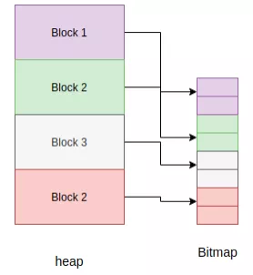

# 内存管理

与C/C++等编程语言不同，MicroPython 通过支持**自动内存管理**，向开发者隐藏了内存管理的细节。自动内存管理是一种由操作系统或应用程序自动管理内存分配与释放的技术。这一技术能解决诸多问题，例如忘记释放为某个对象分配的内存，同时还能避免使用已被释放内存这一严重问题。自动内存管理有多种形式，**垃圾回收（Garbage Collection，简称GC）** 便是其中之一。

垃圾回收器通常承担两项职责：
1. 在可用内存中为新对象分配空间。
2. 释放未使用的内存。

垃圾回收算法种类繁多，而 MicroPython 采用"标记-清除"（[Mark and Sweep](https://en.wikipedia.org/wiki/Tracing_garbage_collection#Basic_algorithm)）策略来管理内存。该算法包含两个阶段：
- **标记阶段（Mark Phase）**：遍历堆内存，对所有"存活"的对象进行标记。
- **清除阶段（Sweep Phase）**：再次遍历堆内存，回收所有未被标记的对象（即不再使用的对象）所占用的内存。

在 MicroPython 中，垃圾回收功能可通过内置的`gc`模块调用，示例如下：
```python
>>> x = 5           # 定义变量x并赋值
>>> x               # 查看变量x的值
5
>>> import gc       # 导入gc模块
>>> gc.enable()     # 启用垃圾回收功能
>>> gc.mem_alloc()  # 查看当前已分配的内存大小（单位：字节）
1312
>>> gc.mem_free()   # 查看当前空闲的内存大小（单位：字节）
2071392
>>> gc.collect()    # 手动触发垃圾回收，返回被回收的对象数量
19
>>> gc.disable()    # 禁用垃圾回收功能
>>>
```

即便调用了`gc.disable()`禁用垃圾回收，仍可通过`gc.collect()`手动触发垃圾回收操作。


## 对象模型

所有 MicroPython 对象均通过 `mp_obj_t` 数据类型进行引用。该类型的大小通常与"字长"一致（即与目标架构上指针的大小相同），常见的位宽包括 32 位（适用于 STM32、nRF、ESP32、Unix x86 架构）或 64 位（适用于 Unix x64 架构）。在某些对象表示方式下，其大小也可能超过一个字长，例如在 32 位架构中，采用 `OBJ_REPR_D` 表示方式时，`mp_obj_t` 的大小为 64 位。

`mp_obj_t` 可表示各类 MicroPython 对象，如整数、浮点数、类型、字典或类实例等。其中部分对象（如布尔值、小整数）的数值会直接存储在 `mp_obj_t` 中，无需额外内存；而其他对象的数值则存储在内存的其他位置（例如受垃圾回收管理的堆内存中），此时 `mp_obj_t` 中仅包含指向该内存位置的指针。`mp_obj_t` 中会划分出一部分空间作为“标记（tag）”，用于标识该对象的具体类型。

有关 `mp_obj_t` 可用表示方式的具体细节，可参考头文件 `py/mpconfig.h`。


### 指针标记（Pointer Tagging）

由于指针遵循"字对齐"规则（即指针地址是字长的整数倍），因此当指针存储在 `mp_obj_t` 中时，该对象引用的“低位”会始终为 0。例如在 32 位架构中，最低 2 位恒为 0，其结构如下：

`********|********|********|******00`

这些低位被预留出来用作"标记位"，用于存储额外信息。相比在对象中新增一个字段来存储此类信息（这种方式可能存在效率问题），利用预留低位存储标记的方案更为高效。在 MicroPython 中，通过标记可以区分当前 `mp_obj_t` 引用的是“小整数”“驻留（小）字符串”还是“具体对象”，不同类型的对象会对应不同的处理逻辑。

各类对象对应的 `mp_obj_t` 结构如下：

**小整数**：

`********|********|********|*******1`

其中星号（*）部分存储整数的实际数值。对于**驻留字符串**（interned string）或**立即对象**（immediate object，例如 True），mp_obj_t 的值的结构分别如下：

`********|********|********|*****010`

`********|********|********|*****110`

**上述类型之外的具体对象**：

`********|********|********|******00`

此处的星号（*）对应具体对象在内存中的地址。

   
## 对象的分配

小整数的值会直接存储在 `mp_obj_t` 中，并且采用**就地分配**（in-place allocation）的方式，不会分配在堆内存或其他位置。因此，创建小整数不会对堆内存产生影响。对于**驻留字符串**（其文本数据已存储在其他位置）以及 `None`、`False`、`True` 这类“立即值”，其分配方式也与此类似，同样不影响堆内存。

除此之外，所有"具体对象"（concrete object）都会在堆内存中分配空间。这类对象的结构特点是：在其**对象头部（object header）** 中会预留一个字段，用于存储该对象的类型信息。

（对象结构示意如下）
```text
############
#          #
#   type   #  （对象头部：object header）
#          #
############
#          #  （对象项：object items）
#          #
#          #
############
```

堆内存的最小分配单位是 **块**（block），每个块的大小为 4 个机器字长（在 32 位机器上为 16 字节，在 64 位机器上为 32 字节）。堆内存中还会分配另一种结构，它用于跟踪每个块中对象的分配状态，这种结构被称为 **位图**（bitmap）。



位图用于跟踪某个块（block）处"空闲"（free）还是"正在使用"（in use）状态，并且会为每个块分配两个二进制位（bit）来记录该状态。

**标记-清除**（mark-sweep）垃圾回收器负责管理在堆内存中分配的对象，同时也会借助位图来标记仍在使用的对象。有关这些细节的完整实现，可参考文件 [py/gc.c](https://github.com/micropython/micropython/blob/master/py/gc.c)。


### 分配：堆内存布局（Heap Layout）

堆内存的组织方式是由多个内存池（pool）中的块（block）构成。每个块可具备不同属性，具体如下：
- **ATB**（分配表字节，allocation table byte）：若该属性被设置（即对应标识位为1），则表示此块为"普通块"（normal block）。
- **FREE**（空闲块）：表示当前块处于未被使用的空闲状态。
- **HEAD**（块链头部）：表示当前块是某条"块链"（由多个块组成的链式结构）的起始块。
- **TAIL**（块链尾部）：表示当前块属于某条块链的末尾部分（即该块之后无后续关联块）。
- **MARK**（已标记头部块）：表示当前块是已被标记的头部块（通常在垃圾回收的"标记阶段"被标记，代表对应对象仍在使用）。
- **FTB**（终结器表字节，finaliser table byte）：若该属性被设置，则表示当前块关联了"终结器"（finaliser）。
