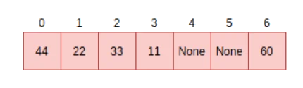
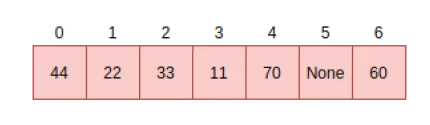

# 映射与字典

MicroPython 中的字典（dictionaries）与映射（maps）采用了**开放寻址（open addressing）** 和**线性探测（linear probing）** 两种技术。


## 开放寻址（Open Addressing）

[开放寻址](https://en.wikipedia.org/wiki/Open_addressing)用于解决**哈希冲突（collisions）** 问题。哈希冲突是非常常见的情况，当两个数据项的哈希值恰好映射到同一个哈希槽（slot）或位置时，就会发生冲突。例如，给定如下哈希结构：



若有一个请求要将数据“70”存入哈希槽 0，但此时槽 0 已被占用（非空），开放寻址会在字典中寻找**下一个可用的哈希槽**来处理该请求。这种为数据项寻找替代存储位置的顺序查找过程，被称为**探测（probing）**。

探测算法有多种实现方式，而 MicroPython 采用的是**线性探测（linear probing）**，具体将在下一节介绍。

## 线性探测（Linear Probing）

线性探测是在字典中寻找可用地址或哈希槽（slot）的方法之一。在 MicroPython 中，它与开放寻址（open addressing）配合使用。针对前文所述的存储请求（将数据“70”存入已占用的槽 0），与其他探测算法不同，线性探测采用**固定间隔 1** 的探测方式。因此，该请求会通过将数据项存入下一个空闲槽来完成。在下面示例中，这个空闲槽是槽 4。



字典中查找数据项时，同样会用到开放寻址和线性探测这两种方法。假设我们要查找数据项 33：计算得出其哈希值对应的槽位是 2，查看槽 2 发现数据正是 33，此时直接返回“存在（True）”即可。而查找数据项 70 的过程则完全不同，因为该数据在插入时发生过哈希冲突。计算 70 的哈希值会得到槽位 0，但当前槽 0 中存储的是 44；此时不会直接返回“不存在（False）”，而是从槽 1 开始进行顺序查找，直到找到数据项 70，或遇到一个空闲槽为止。

哈希表中查找操作的通用实现逻辑如下（代码片段）：
```c
// 尚未找到目标，继续在当前表中搜索
pos = (pos + 1) % set->alloc;

if (pos == start_pos) {
    // 搜索回到起始位置，说明目标不在表中
    if (lookup_kind & MP_MAP_LOOKUP_ADD_IF_NOT_FOUND) {
        if (avail_slot != NULL) {
            // 存在可用槽位，使用该槽位
            set->used++;
            *avail_slot = index;
            return index;
        } else {
            // 表中空间不足，执行重哈希（rehash）
            mp_set_rehash(set);
            // 为新元素重新开始搜索
            start_pos = pos = hash % set->alloc;
        }
    }
} else {
    return MP_OBJ_NULL;
}
```
