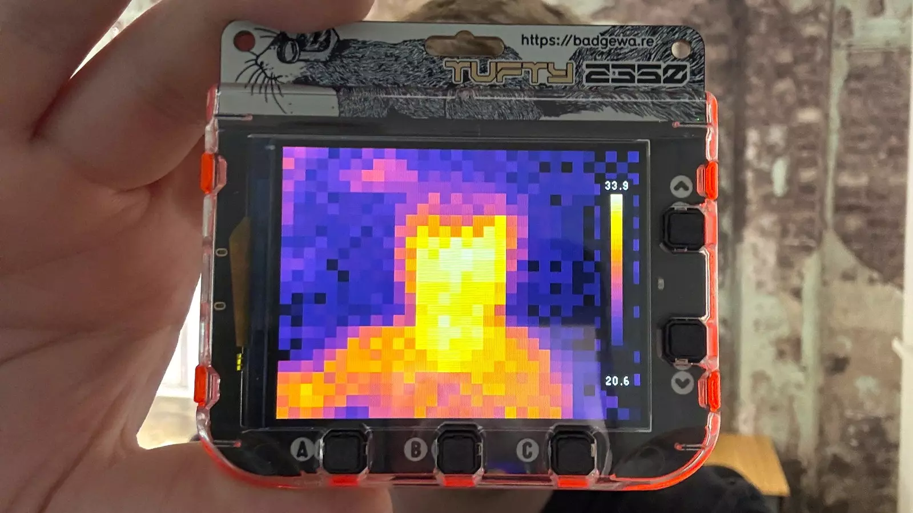

# 采用 TUFTY 2350 和 MLX90640 制作热像仪

采用 TUFTY 2350 和 MLX90640 制作一台手持式热像仪，它可以发现家中的寒冷区域、电脑中的发热芯片，以及猫咪在床下躲藏的位置。使用 micropython 编程。

**需要**
- TUFTY 2350 开发板
- MLX90640 摄像头
- 50毫米Qw/ST线缆
- 亚克力板
- 双面胶带

**项目链接**

https://learn.pimoroni.com/article/build-a-thermal-camera-with-tufty-2350
