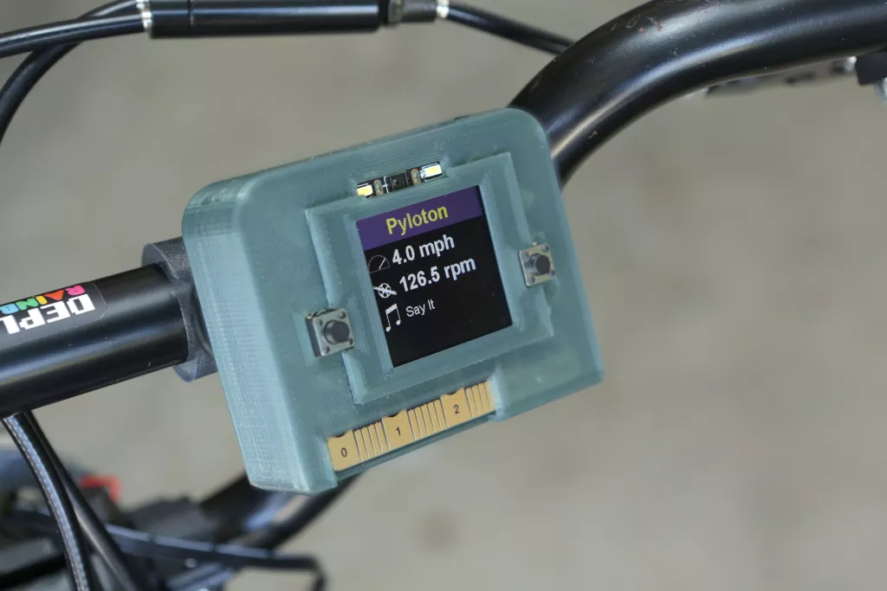

# CircuitPython 自行车电脑

Pyloton 是一台使用 CLUE 开发板制作的 CircuitPython 自行车电脑。Pyloton 可以测量蓝牙 LE 心率、速度和节奏。

它还提供 Apple Music Service 的歌曲信息，可在一个带有锐利显示屏的小型设备上使用，并配备 3D 打印的手柄支架(或可选的腕挂支架)。

https://learn.adafruit.com/pyloton
