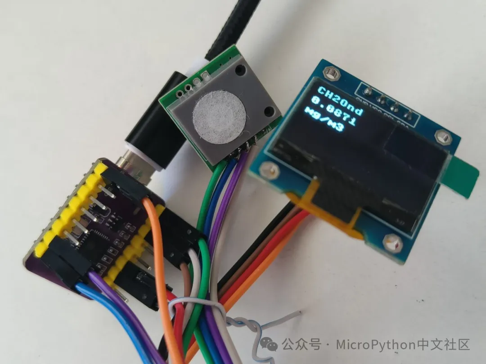

# DIY一个多功能甲醛检测仪

最近搬到新的办公场地，虽然办公室里放了不少活性炭，也种了不少绿植，但还是感觉气味有点大，所以就想制作一个简易的甲醛检测仪，可以随时查看空气中甲醛浓度。后来又想查看任意时间的数据，分析浓度的变化，同时还要能远程查看，因此又增加了历史数据和远程功能。

使用这里介绍的方法，不需要购买服务器和域名，不需要注册账号，不需要安装特殊软件，也不需要复杂的软件配置，甚至不需要专门技能，即使是没有太多基础的爱好者，也只要数小时，按照下面步骤就能复制一个出来，还能随时增加功能。

## 使用的硬件

- CH2O 甲醛传感器
- ESP32开发板 x 2
- OLED显示屏（可选）
- WS2812灯环（可选）
- 树莓派

## 相关链接

- 微信公众号
	- [DIY一个多功能甲醛检测仪（一）](https://mp.weixin.qq.com/s/mmEKNzwPQLi_3NApjSGceQ?token=438849232&lang=zh_CN)
	- [DIY一个多功能甲醛检测仪（二）](https://mp.weixin.qq.com/s/PinbINwd2Ei67nEK1hWbbQ?token=438849232&lang=zh_CN)
	- [DIY一个多功能甲醛检测仪（三）](https://mp.weixin.qq.com/s/q0dW9oIHGCAA1u4OpM74LQ?token=438849232&lang=zh_CN)
- [github 仓库](https://github.com/shaoziyang/ch2o)
- [gitee 仓库](https://gitee.com/shaoziyang/ch2o)
