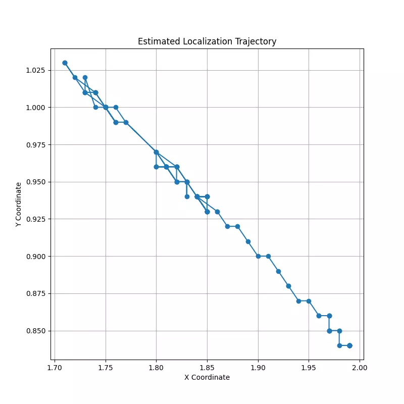

# ESP32 室内定位系统

**摘要**：本文介绍了一种基于 RSSI 的室内定位系统（IPS），该系统完全基于 ESP32 微控制器硬件，使用 MicroPython 构建。三个 ESP32 接入点（TestNetwork1、TestNetwork2、TestNetwork3）在固定位置充当锚节点。移动目标 ESP32 扫描来自每个锚点的 Wi-Fi 信号强度，应用卡尔曼滤波器来抑制多径噪声，使用对数距离路径损耗模型将滤波后的 RSSI 值转换为距离估计，并使用闭合形式的三边测量来计算 2D 位置。通过使用最小二乘拟合在1、2、3和4米距离收集 50 个 RSSI 样本，对路径损耗模型进行了经验校准，得出a=-61.92 dBm，n=1.64。从三个锚节点记录的实际测量数据表明，卡尔曼滤波使锚1的RSSI标准偏差降低了57.1%，锚2降低了25.0%，锚3降低了4.1%。该系统成功地跟踪了从（1.99，0.84）米到（1.85，0.94）米的目标节点轨迹，在受约束的微控制器硬件上实现了稳定的实时定位。完整的实现是开源的，可以在 GitHub 上找到。



## 要求

- ESP32
- 3个无线锚点/接入点
- MicroPython 或 Arduino IDE

## 系统架构

```
          Anchor Node 1
               *
              / \
             /   \
            /     \
           /   X   \
          / Target  \
         /           \
        *-------------*
Anchor Node 2     Anchor Node 3
```

## 相关链接

- [reddit](https://www.reddit.com/r/esp32projects/comments/1tl6ng0/built_indoor_positioning_system_on_esp32_using_3/)
- [linkedin](https://www.linkedin.com/posts/harshonweb_built-indoor-positioning-system-on-esp32-ugcPost-7462890248155611136-CUaB/?utm_source=share&utm_medium=member_desktop&rcm=ACoAAD3j6f0BKuGJORdwBDPuhNf2LW0j8wkgNMs)
- [论文](https://zenodo.org/records/20310320)
- [github 仓库](https://github.com/harshsaxena213/Indoor-Positioning-System-Application-On-ESP32/tree/main)
