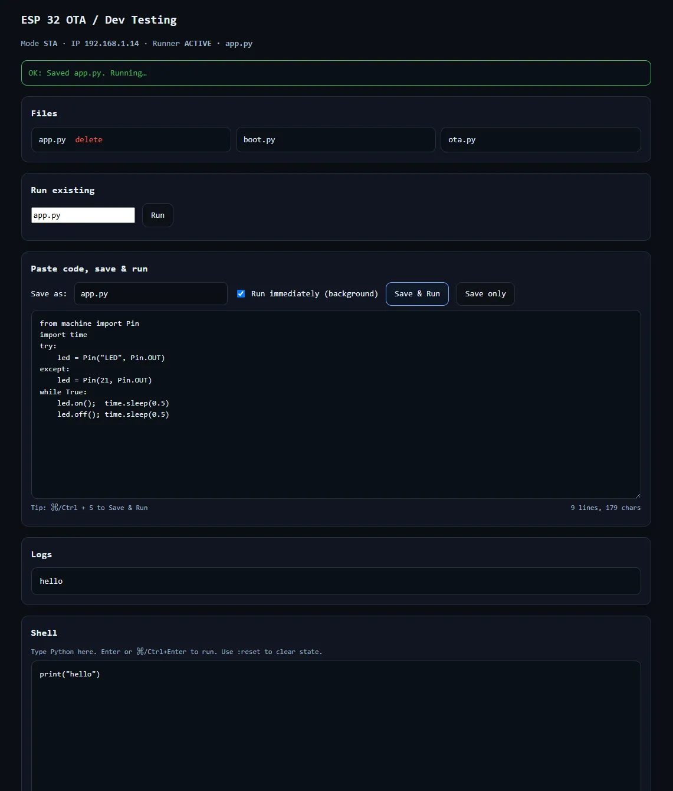

# ESP32的带密码保护 OTA Web IDE

适用于 ESP32 / ESP32-S3 板上的 MicroPython 密码保护的 OTA Web IDE。

### 🌐 概述
该项目允许您直接从浏览器编写、上传和执行 MicroPython 代码 ——无需串口连接。
包括：
- 一个直接由 ESP32-S3 提供的最小网页 IDE
- 用户名/密码保护以实现本地安全访问
- 文件管理（保存、删除、运行）
- 通过网页界面实时输出日志
- 内置硬复位

### ⚙️ 特征
- 直接从浏览器保存并运行代码
- 运行设备上存储的现有 .py 文件
- 删除不需要的文件
- 网页上的实时串行日志输出
- 基础认证（默认： admin / admin）
- Shell 也能在不保存到设备的情况下测试脚本

### 使用
1. 写入 micropython 固件
2. 上传所需文件
3. 配置 Wi-Fi
4. 更改登录凭证
5. 从 Thonny IDE 获取 IP
6. 使用网页界面
	1. Connect your ESP32 to the same Wi-Fi network.
	2. Open the IP shown in Thonny (http://192.168.x.x).
	3. Enter your login credentials.
	4. Write or paste your MicroPython script.
	5. Click Save & Run to execute immediately.
	6. Watch the live logs on the same webpage.
	7. If you update the script values just hard rest to ensure safe running.

https://github.com/TuzaaBap/esp32-ota-dev-testing 
