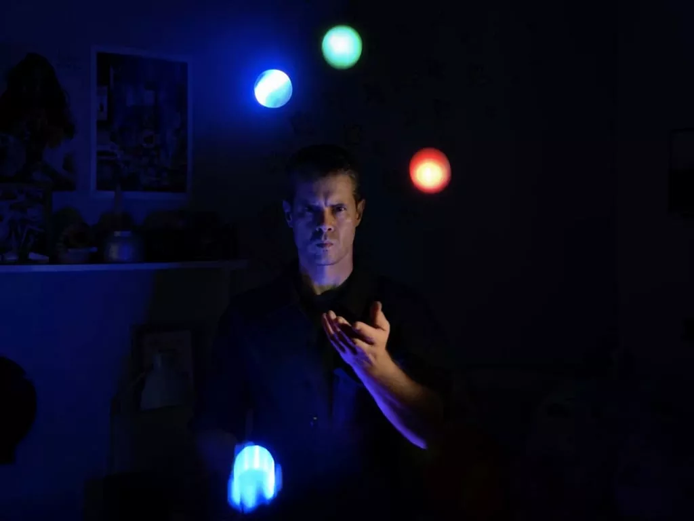
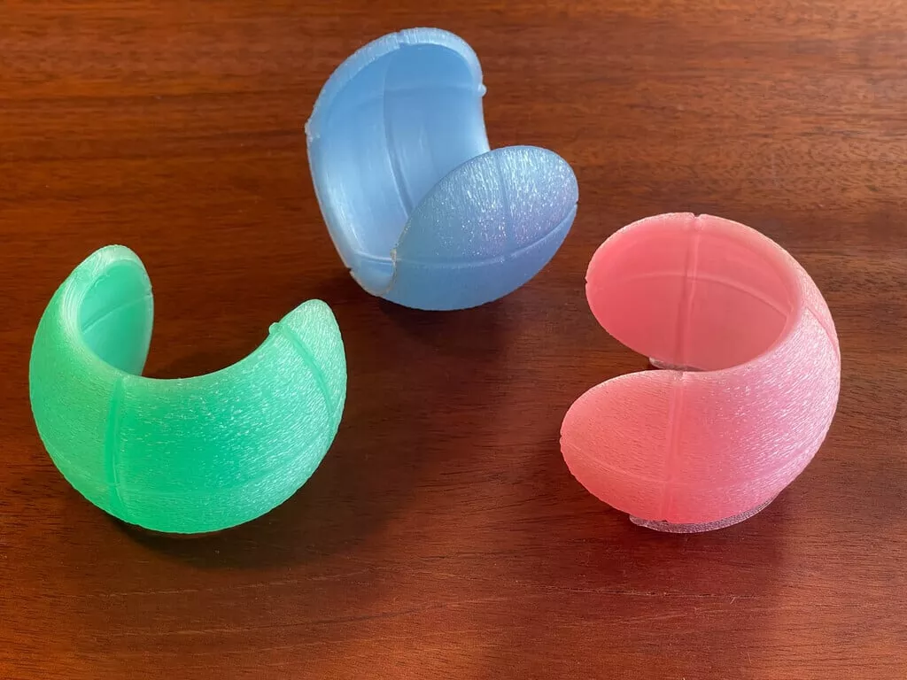
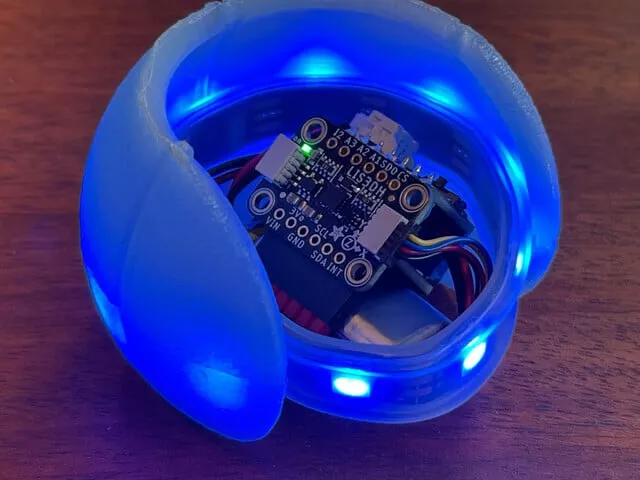
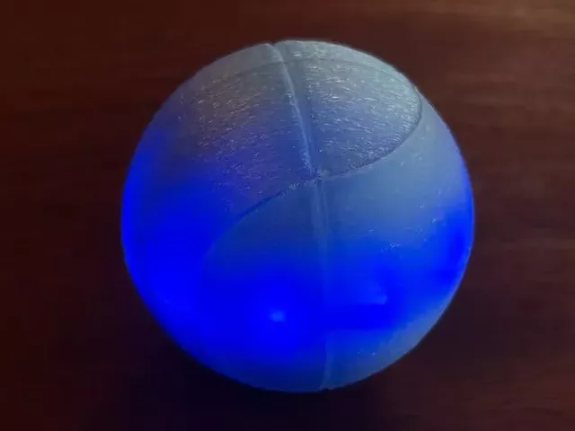
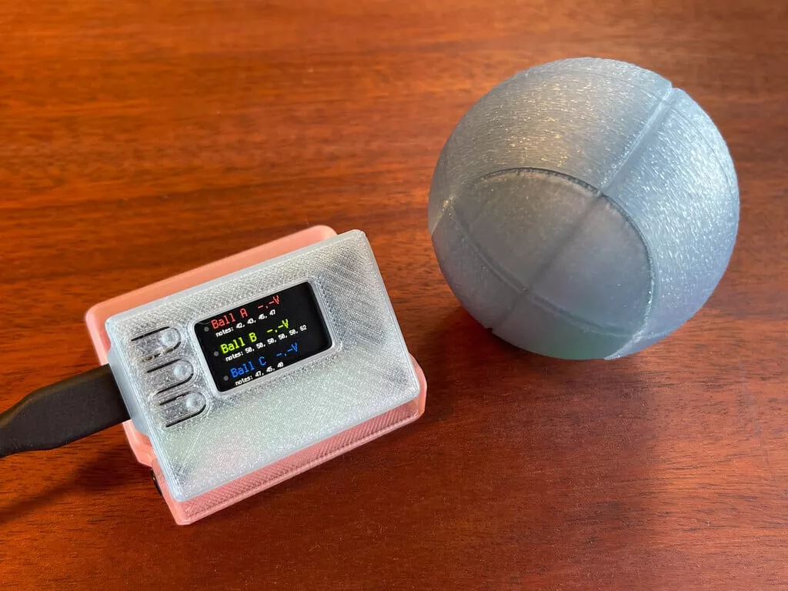

# ESP-NOW 无线 LED 杂耍球

使用 CircuitPython 和低延迟的 ESP-NOW 协议创建交互式无线音乐LED杂耍球。通过检测 LIS3DH 加速度计触发 MIDI 音符，同时将消息发到计算机或 USB 主合成器，可以在 CircuitPython 中编写任何喜欢的音符或交互模式。

3D 打印外壳

组装

USB 接收器

来自：https://learn.adafruit.com/wireless-juggling-balls-esp-now?view=all

