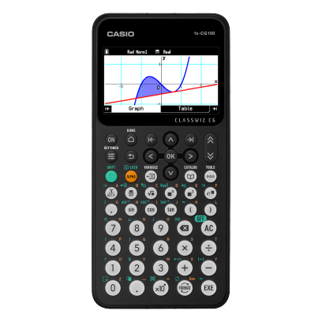

# fx-CG100 ClassWiz 图形计算器   

卡西欧美国公司发布了其 fx-CG100 ClassWiz 彩色图形计算器，该计算器能够使用 MicroPython 编程自定义应用程序。顶级型号拥有超过 2900 个功能，允许用户应对从 K-12 到研究生院的学生的各种数学挑战。   

    

## 基本功能   
- 角度单位，角度单位转换（度、弧度、梯度）   
- 三角函数，反三角函数   
- 双曲函数，反双曲函数   
- 指数函数，对数函数   
- 幂函数（平方根、立方根、平方、幂、根）   
- 坐标转换（极坐标 Pol，直角坐标 Rec）   
- 组合/排列（nCr, nPr）   
- 阶乘，倒数，随机数，列表中已有的数据随机抽样，分数运算   
- 逻辑运算   
- 六十进制 ↔ 十进制转换   
- 矩阵计算   
- 向量计算   
- 复数计算   
- 进制计算与转换（二进制、八进制、十进制、十六进制等）   
- 列表数据计算   
- 四舍五入   
- 显示格式设置   
- 单位换算（预装软件）   
- 工程符号计算   
- 工程记数法   
- 质因数分解   
  
## 图形功能   

- 3D图形（预装软件）   
- 直角坐标图形，极坐标图形   
- 积分图形   
- 参数方程绘图，不等式绘图   
- 追踪（Trace），缩放（框选缩放、放大、缩小、自动缩放）   
- 表格与图形   
- 绘图功能（切线、法线、反函数）   
- 解析功能（求根、极小值、极大值、交点、积分：改进的积分计算，新增混合积分函数）   
- 动态图形   
- 递归数列图形   
   
## 统计功能   

- 基于列表的单变量和双变量统计分析   
- 统计回归计算   
- 统计图表（散点图、xy折线图、正态概率图、直方图、箱型图）   
- 统计回归图（线性、中位数-中位数、二次、三次、四次、对数、指数、幂函数、正弦、逻辑斯蒂回归）   
- 高级统计计算：检验（Z检验、t检验、χ²检验、F检验、方差分析 ANOVA）、区间估计（Z区间、t区间）、分布计算   
- 饼图   
- 条形图   
   
## 硬件规格 硬件规格   

- 电源：4节AAA碱性电池或4节镍氢可充电电池   
- 电池寿命（大约小时）：   
    - 碱性电池：140 小时   
    - 镍氢电池：85 小时 （假设每小时使用5分钟计算，显示55分钟）   
- 点阵显示屏：216 x 384 点   
- 显示容量（字符数）：21 字符 × 8 行   
- 内部运算位数：15 位   
- 支持嵌套括号层数：26 层   
- 数据通信：3针串口线、USB线   
- 3针串行接口   
- USB接口   
   
[https://www.casio.com/us/scientific-calculators/product.FX-CG100/](https://www.casio.com/us/scientific-calculators/product.FX-CG100/)   

