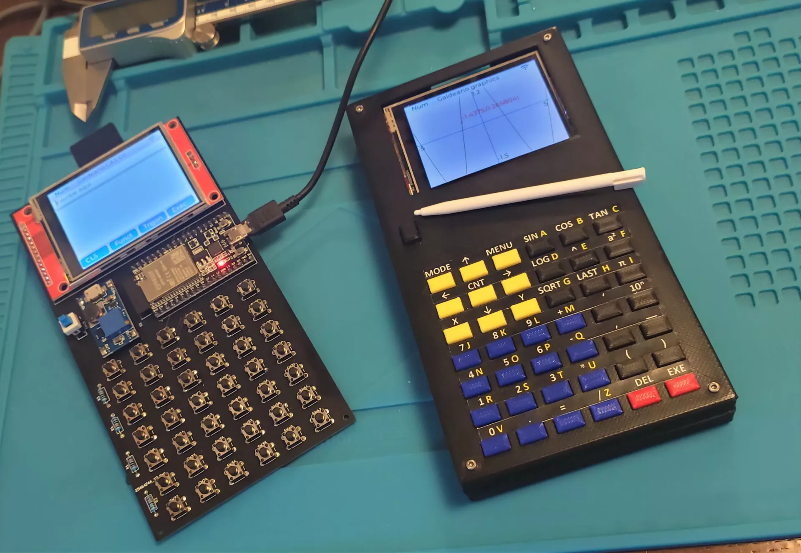

# Galdeano 手持式计算机

Galdeano 是一个带有完整键盘和内置符号数学引擎的 Python 便携式电脑。

它的核心是一块带有 4 Mb SPI RAM 的 ESP32。PCB 是定制的，显示屏（320x240）是带有触摸传感器的 ili9341。它运行一个定制的 micropython 发行版，带有 LVGL 图形和作为模块的数学引擎（Eigenmath）。程序在数据分区中运行，易于自定义和扩展。目前，可以运行符号计算器、文本编辑器、绘制图形函数、Philips Hue 灯光控制器以及定制的重量控制系统。

**相关链接**
* [hackaday 项目说明](https://hackaday.io/project/187213-galdeano-handheld-computer)
* [github 代码仓库](https://github.com/otosan-maker/galdeano-lv)
