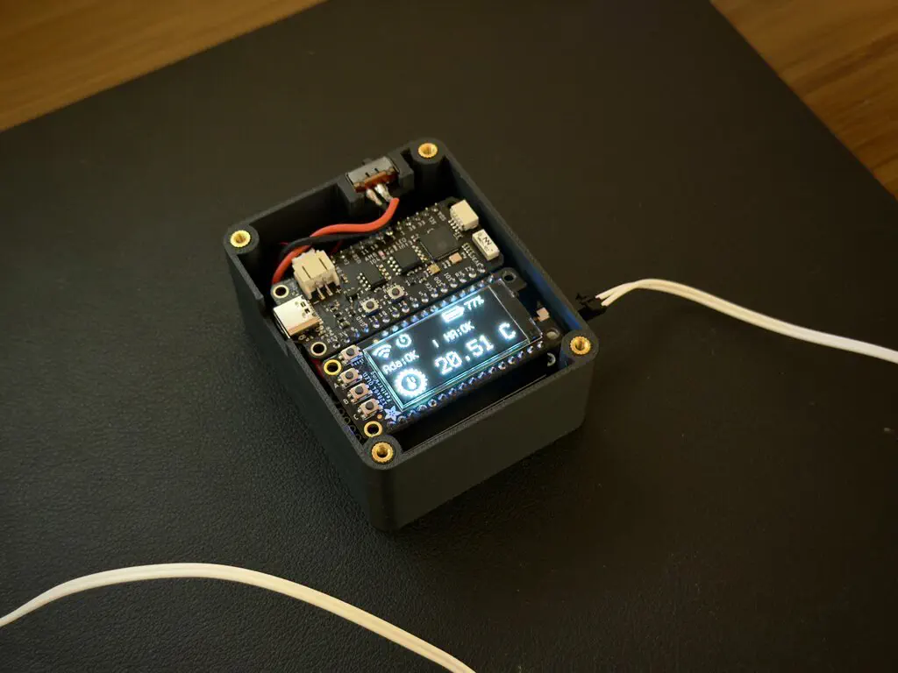
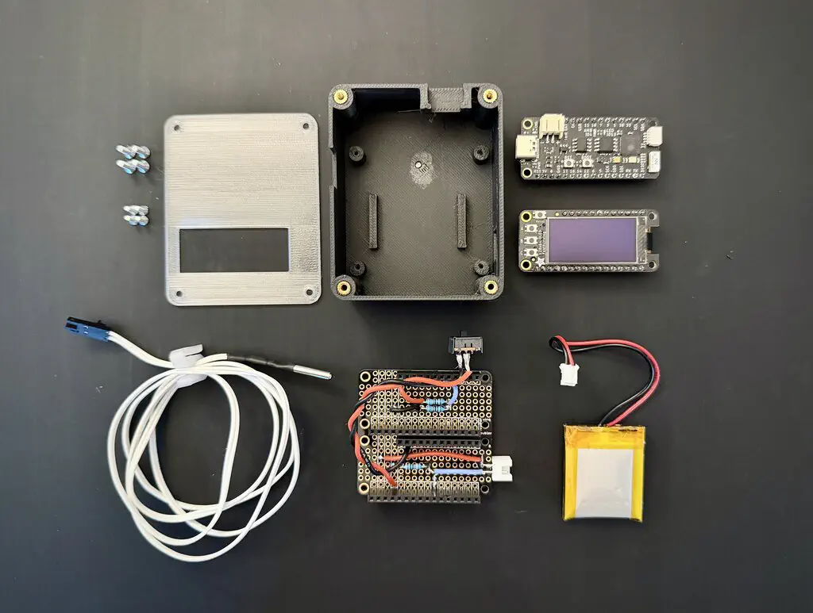

# Homekit 兼容的温度监控系统

使用 CircuitPython 编程控制的温度监控系统，可以集成到 Apple HomeKit。   
   
    
   
    
   
相关链接   
- [完整说明](https://www.movingelectrons.net/posts/freezer-temperature-monitor---version-2.0)   
- [github 仓库](https://github.com/Moving-Electrons/temperature-monitor)   
   
