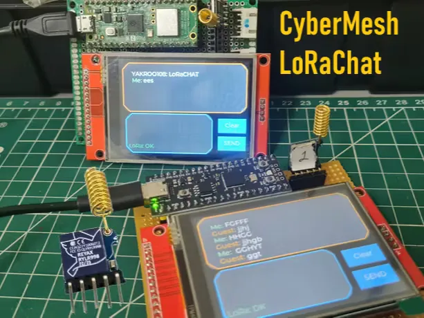

# CyberMesh LoRaChat

CyberMesh LoRaChat 是一种用于紧急情况的去中心化通信设备。现代通信系统高度依赖集中式基础设施，如电网、蜂窝网络、互联网连接和云服务器。虽然这些系统在日常生活中运作良好，但在灾害发生时——洪水、地震、野火或大规模停电——时常常会失效。当电力和网络基础设施崩溃时，通信通常是最先消失的——正是在最关键的时候。

这一现实激发了 CyberMesh LoRaChat 的开发 ：一款去中心化通信设备，设计无需互联网、蜂窝网络或任何中央服务器即可使用。该项目旨在通过设备间直接通信，在紧急情况下提供一种简单可靠的短信交换方式。CyberMesh LoRaChat 是一款基于 LoRa（远程无线电） 技术构建的点对点短信系统 。每个设备作为独立节点运行，能够直接与其他节点发送和接收消息。没有网关，没有云后端，也没有单点故障。即使部分网络无法使用，剩余设备仍可继续通信。

这使得 CyberMesh LoRaChat 适合以下用途：
- 紧急与灾难场景
- 无网络或偏远地区
- 通信系统备份
- 教育与创客项目

## 系统架构

每个 CyberMesh LoRaChat 节点由以下组成：

* 树莓派 Pico 2 – 主控制器
* ILI9341 TFT 显示 ——用户界面
* LVGL – 图形界面框架
* MicroPython – 固件开发
* RYLR998 LoRa 模块 ——远程无线通信

用户可以通过类似基本聊天终端的简单设备界面输入、发送和接收简短文本。

**完整说明**

https://www.hackster.io/yakroo/cybermesh-lorachat-da39ac#/
