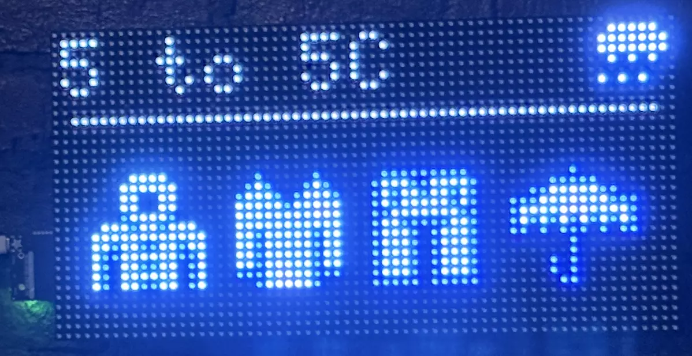
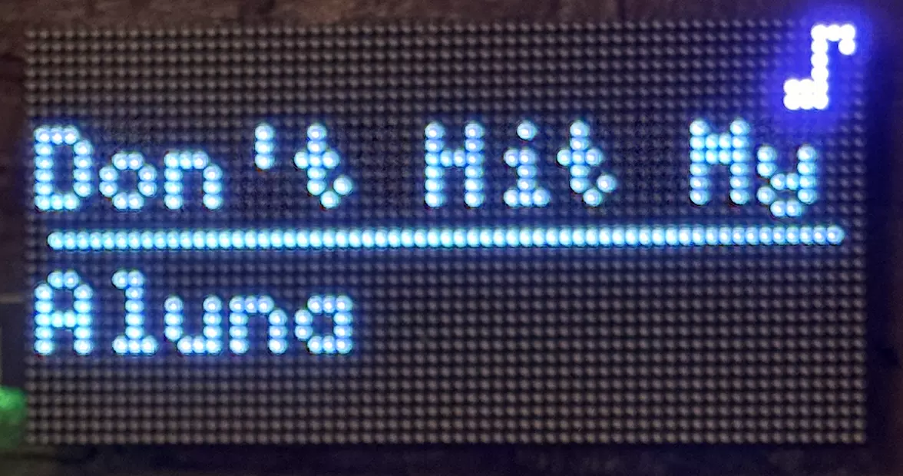

# MatrixPortal 智能信息面板

> 我一直想在公寓里装一个小型常亮显示屏，出门前不用看手机就能快速获取信息。看到 Adafruit Matrix Portal S3 搭配 64×32 RGB LED 点阵屏后，我终于有理由动手做一个了。

## 设计初衷
每天早上我都要重复同一件事：用手机查天气，再决定穿几层衣服。纽约的天气每天都不一样，我想要一个能直接告诉我该穿什么的小装置。

## 解决方案

64×32 的屏尺寸很小（仅 2048 个像素），信息展示必须简洁克制。我设计了两行紧凑信息区：

- 当日温度区间（最低温–最高温）
- 天气状态图标（晴天 / 下雨 / 下雪）
- 最多 4 个穿搭图标 —— 外套、夹克、长袖、长裤、雨伞、帽子，可通过温度与降水阈值自定义触发条件

天气数据来自 [Open-Meteo](https://open-meteo.com/)（免费、无需 API 密钥、接口稳定）。穿搭判断逻辑就是一组简单的温度阈值规则，和我看天气 APP 时的判断思路完全一致。

## 功能扩展：正在播放
装上墙后我发现，这块屏 99% 的时间都处于闲置状态。于是我加了第二种显示模式：通过 HTTP 接口提交歌曲名与歌手，屏幕会自动切换到带音符图标的滚动播放信息界面。屏用的是等宽字体，每行只能显示约 12 个字符，超长内容会循环横向滚动。30 分钟后（可自定义）自动切回天气界面。

## Home Assistant 接入
这块开发板开放了一套轻量 HTTP API：/on、/off、/status、/data、/media、/media/stop、/media/status。借助这些接口，我把它接入 Home Assistant，做成一个开关（配合定时自动化，夜间自动关闭）和几个传感器（实时温度区间、天气状态、穿搭建议）。

我还做了自动化：电视打开时关闭点阵屏，避免看电影时被亮屏干扰；电视关闭后再自动点亮。完整配置示例写在 README 里。

## 使用效果
这块屏已经挂在墙上好几个月了。我和妻子出门前、想知道 “正在播什么歌” 时都会看它，能做出一个真正实用的小装置，我还挺得意的。

完整代码、硬件说明与 Home Assistant 接入教程可在 GitHub 查看：[https://github.com/GuyLewin/matrixportal-concierge](https://github.com/GuyLewin/matrixportal-concierge)。

完整文档：https://guylewin.com/blog/2026-04-26-matrixportal-concierge/
