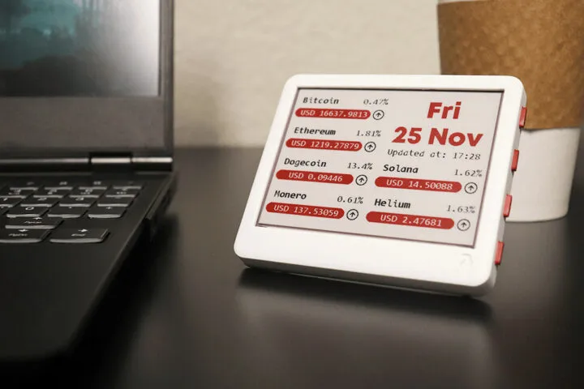

# 开源三色无线电子纸显示器Merlot

Merlot 是一款三色电子纸显示器，带有基于 ESP32 无线 SoC 的开源硬件控制板，可通过 Arduino、MicroPython 或 ESP-IDF 框架进行编程。

Merlot 规格：

- 无线模块 – ESP32-WROOM-32 模块，4 MB SPI 闪存、2.4 GHz WiFi 4 和蓝牙 LE 连接
- 储存 – 用于存储图像、文件等的 MicroSD 卡插槽
- 显示屏 – 4.2 英寸**三色**电子纸显示屏，分辨率为 400 x 300;完全刷新：~ 17 秒;部分更新：也是 17 秒......
- USB – 1 个 USB **Type-C**，用于充电和编程
- 扩展 – 26 针扩展接头，带有 8 个 GPIO、I2C、UART、SPI
- 调试 – 通过连接到 CP2104 USB-UART 芯片的 USB **Type-C** 端口
- 其他 – 4 个触觉按钮、压电蜂鸣器、复位按钮、充电 LED
- 电池 – 3.7V 1,900 mAh LiPo 电池
- 电源 – 通过 USB **Type-C** 端口提供 5V、2 针电池连接器和电池充电器电路
- 功耗 – 睡眠模式下 <20uA
- 尺寸 – PCB：92.1 x 78.1 毫米;外壳尺寸为 98 x 82 x 16 毫米
- 认证 – FCC/CE

https://www.cnx-software.com/2022/12/23/merlot-is-an-open-source-hardware-tri-color-wireless-e-paper-display/
