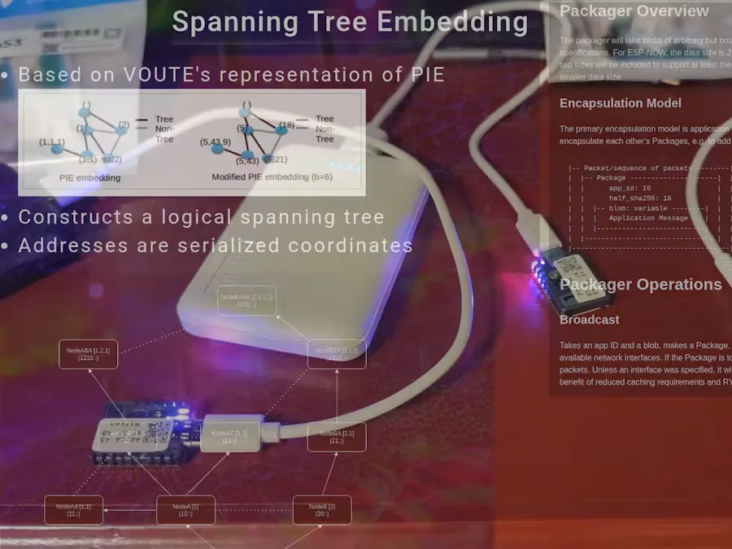

# 可路由网状网络 Micropycelium

Micropycelium 是一个原型的、可路由的网状网络。其目的是创建一个低成本的自主网络系统，该系统可以在自然灾害或其他灾难发生严重损坏的灾难后大规模部署。该项目的最终目标是易于使用的路由器（最终具有太阳能电池板充电功能）和易于使用的手持设备或网络适配器。

为了建立一个自主的、可路由的网络，需要一种贪婪的算法。贪婪路由算法能够仅使用路由器本地已知的数据来路由数据包，而无需任何集中数据收集或集中分配号码。有几个候选者可供选择，我选择调整使用树嵌入的虚拟叠加系统。在 VOUTE 中，节点仅使用与其直接对等方（网络邻居）的通信来创建生成树，并且该协议旨在最终与在跨越整个网络的逻辑树中分配位置的所有节点进行结算。

代码完全是用 micropython 手工编写的（没有 AI 帮助）。它有几个主要组件：

1. 主“Packager” 类 ，处理所有数据包路由和事件管理逻辑。
2. 序列化/封装类和辅助函数。
3. 用于管理对等方、排队事件、地址、应用程序等的辅助类。
4. ESP-NOW 接口适配器。
5. 用于对等发现、gossip、生成树的构建和维护以及测试/调试的应用程序。
6. 大量的单元和 e2e 测试。
7. 控制台代码和杂项固件。

**相关链接**：

- [Hackster 说明](https://www.hackster.io/k98kurz/micropycelium-prototype-routable-mesh-network-for-esp32-e2e71b)
- [github 代码](https://github.com/k98kurz/micropycelium)
