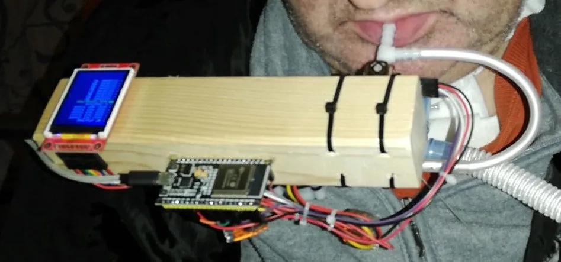

# Mouth Mouse 项目

Mouth Mouse 是为残疾人(例如四肢瘫痪)设计的。他们不用四肢，而是用嘴和吹气来控制鼠标的移动和点击。

**这个项目的目的是什么？**

这样的商业鼠标可能非常昂贵，高达2000欧元（我所看到的）。并不是所有的健康保险都能支付这个费用。例如，他们在德国、瑞士、丹麦、挪威和瑞典付款，但在奥地利不行。这款鼠标大约32欧元（ESP32芯片\[10欧元\]、操纵杆\[2欧元\]、水流传感器\[10欧元\]、电线\[7欧元\]、硅管\[3欧元\]）。这项工作的代码是免费的，并将永远免费提供。它的目的是免费提供这一点，但个人需要购买部分元件。它在所需的部分方面保持非常简单，这些部分在任何地方都可用，以确保每个人都可以访问并能够构建它。

**Mouth Mouse的特点**

- 蓝牙连接，无需连接到PC的电缆，因此您可以使用远程大屏幕，例如带有树莓派的电视，它内置了蓝牙。
    
- 吹气是在点击模式点击。在拖放模式下（通过按下操纵杆激活-感觉像是点击），一次吹气选择对象，例如纸牌游戏中的一个窗口或一张牌。第二次吹气将释放指针移动到的位置。
    
- 操纵杆用于移动鼠标指针。
    

Mouth Mouse 项目中包含了一些针对蓝牙的功能，如蓝牙鼠标、蓝牙摇杆，对ESP32的蓝牙编程很有参考。

**项目网站：**

- https://github.com/mibragri/mouthMouse
