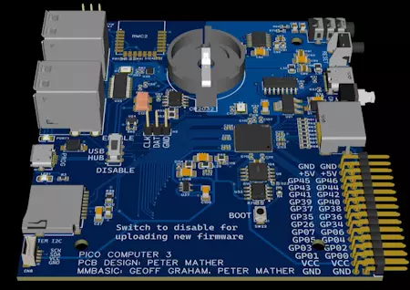

# Pico Computer 3

MicroPython 移植到了 Pico Computer 3 上（基于 RP2350B），可将 Pico Computer 3 变为独立电脑：带有 HDMI 显示屏、USB 键盘/鼠标/触摸、SD卡、音频、实时时钟和WiFi，可直接通过 Python 的 REPL 提示进行操作。很多该功能由 PicoMite MMBasic 固件移植。

https://github.com/UKTailwind/micropython/blob/v0.2/ports/rp2/boards/PICO_COMPUTER_3/USER_MANUAL.md
