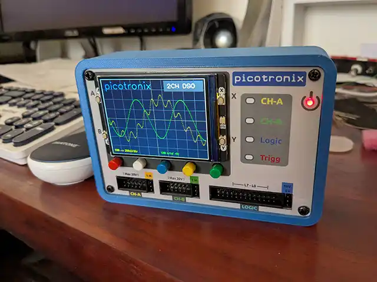

# Picotronix

**基于 Pico 的测试与测量解决方案**

Thort Werx 正准备推出一款紧凑型模块化桌面工具的众筹活动：Picotronix。Picotronix 是一款低成本模块化台式工具，由一对 Raspberry Pi Pico 2 驱动。

Picotronix 本身采用紧凑型设计，以彩色液晶显示屏作为其主要用户界面。内部装有一对基于第二代RP2350微控制器的Raspberry Pi Pico 2 —— 这意味着用户可以选择两个 Arm Cortex-M33 内核，或者选择免费且开源的 Hazard3 RISC-V 内核，这些内核的运行频率为150MHz，片上 SRAM 为520kB。在 Picotronix 中，Arm 内核用于托管 MicroPython 固件和自定义代码，这些代码利用芯片的直接内存访问（DMA）和可编程输入/输出（PIO）功能来提升性能。

目前能够用作双通道示波器、八通道逻辑分析仪，并且能够轻松进行电压和频率测量 —— 但这并不是全部功能。其前部连接器支持使用模块化 "picoPod" 板，从而扩展设备的功能，计划中的picoPod包括波形发生器、高速模数转换器（ADC）、可变阈值逻辑输入，以及杰克逊戏称为“特殊用途适配器”的部件，以进一步扩展功能。

https://picotronix.com/
