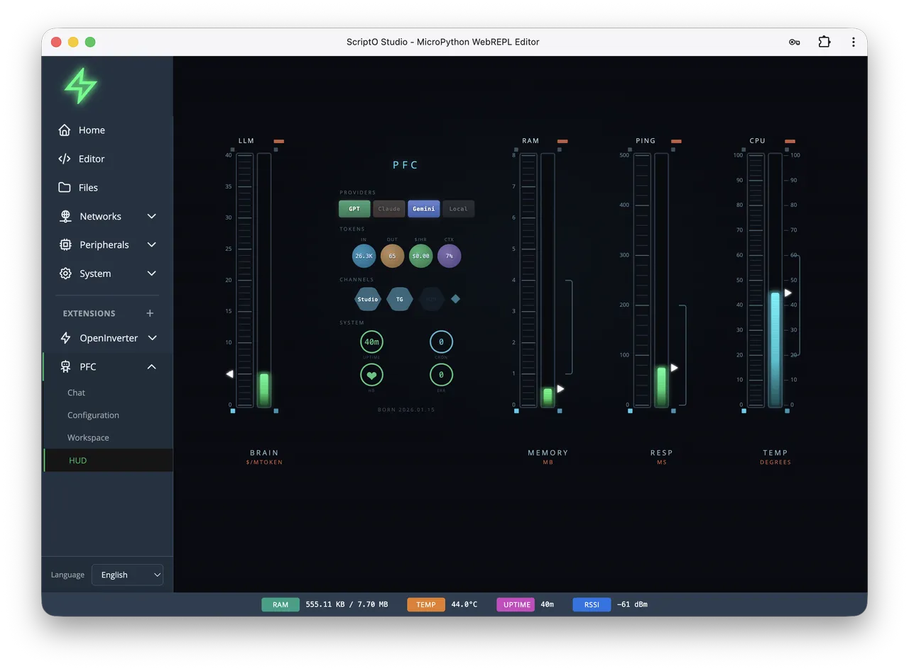

# pycoClaw

pycoClaw 是 OpenClaw 的一个全功能 MicroPython 实现

它是一个在售价 5美元的 ESP32-S3 上运行于 MicroPython 之上的完整人工智能代理。它不是一个‘发送提示并获得响应’的包装器 —— 而是一个与 OpenClaw 兼容的完整代理循环，具备递归工具调用、上下文压缩、持久存储（混合TF-IDF+向量搜索，支持SD卡）、多模型路由、后台任务等功能。

## 相关链接

- [网站](https://pycoclaw.com/)
- [GitHub](https://github.com/orgs/micropython/discussions/18889)
- [Adafruit博客](https://blog.adafruit.com/2026/03/04/pycoclaw-is-a-fully-featured-micropython-implementation-of-openclaw/)
