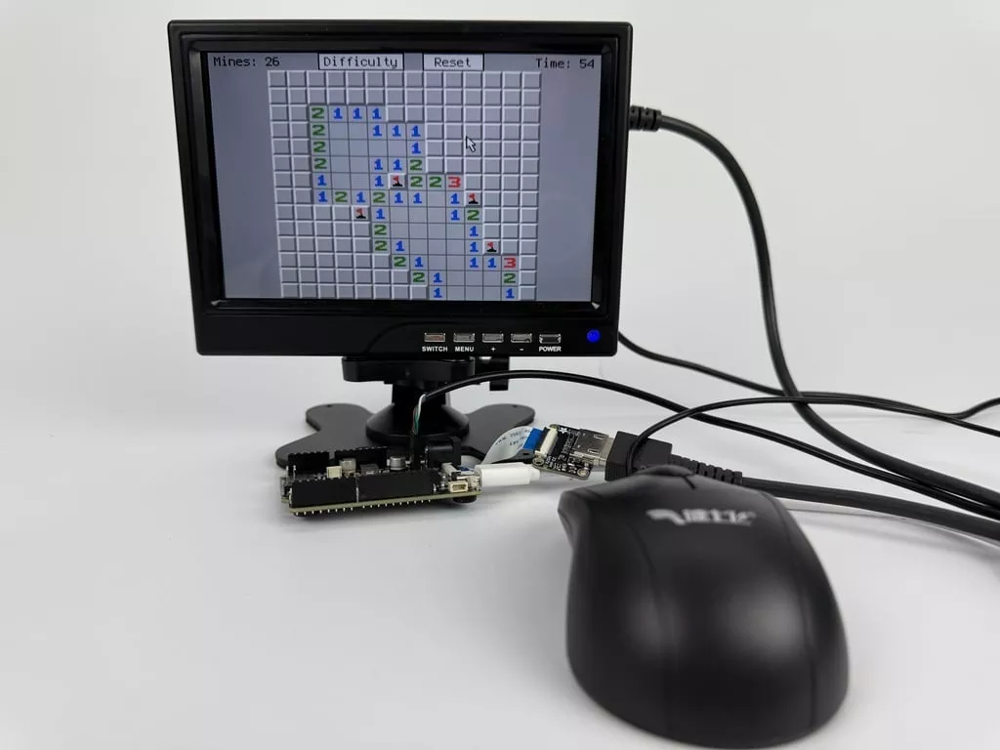

# Metro Rp2350 扫雷游戏

该项目展示了如何使用连接到 Metro RP2350 USB 主机引脚的鼠标来运行扫雷逻辑谜题游戏。它包括下拉菜单等控制功能，用于设置难度和确认重置。这是对许多系统上实现的经典扫雷游戏的改编。它允许右键点击在已知地雷上设置旗帜，或用问号标记未知方格。

<video controls autoplay loop>
  <source src="gaming_Gameplay.mp4" type="video/mp4">
</video>

https://learn.adafruit.com/minesweeper-on-metro-rp2350?view=all 
