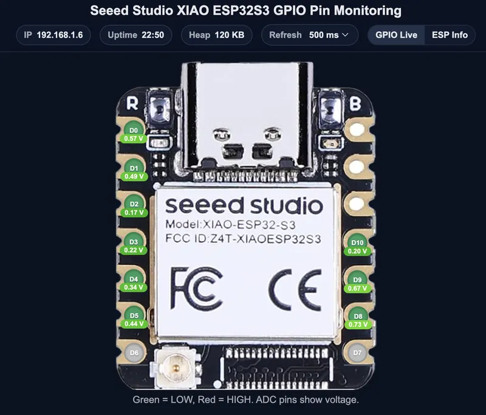
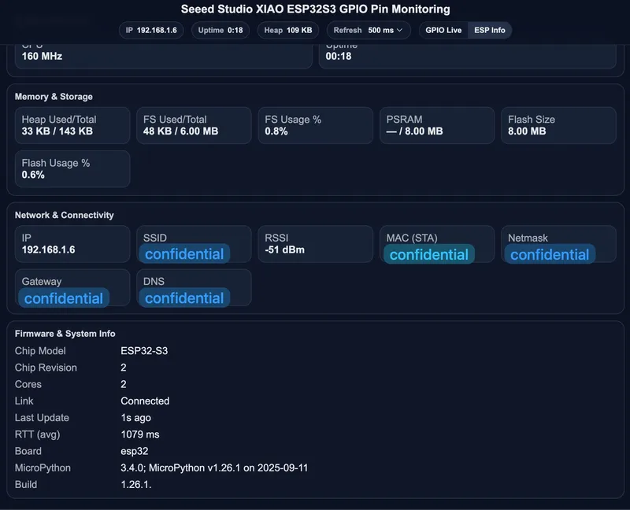

# Seeed Studio XIAO ESP32S3 GPIO Viewer

Seeed Studio XIAO ESP32S3 的基于 MicroPython 实时 GPIO 监控器，通过本地网页界面实时显示数字引脚状态（高/低/触控）。

**GPIO 面板**

**ESPInfo 面板**

项目网址：  
https://github.com/TuzaaBap/Seeed-Studio-XIAO-ESP32S3-GPIOViewer
