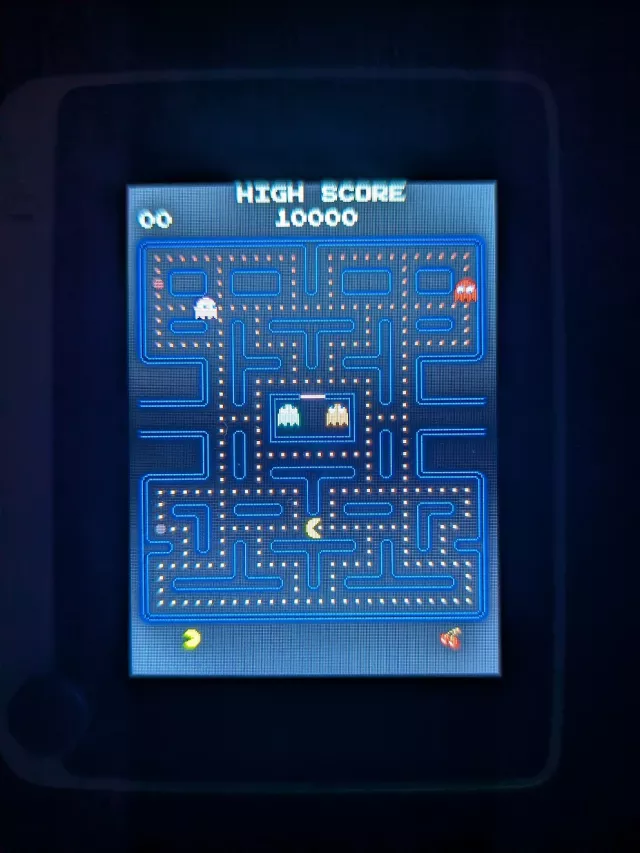

# Seeed Wio 吃豆人游戏

使用 CircuitPython 10 为 Seeed Wio 终端构建的像素级完美的吃豆人游戏克隆版。

**特性**
- **真实游戏体验** — 经典吃豆人机制，包括幽灵AI、能量球和惊吓模式
- **四个独特的幽灵** — 布林基、平奇、因基和克莱德，具有街机游戏中的精确行为模式
- **奖励水果** — 樱桃、草莓、橙子、苹果等水果将陆续出现
- **音效** — 内置蜂鸣器可发出进食声、死亡旋律和开机铃声
- **记分板** — 街机风格的显示界面，包括 1UP、最高分、剩余生命数和当前等级的水果
- **自定义字体** — 按“开始”键选择复古街机字体
- **性能优化** — 在 Wio 终端的有限资源下仍能流畅运行

这款游戏已在 [GitHub](https://github.com/scarolan/pac-wio) 上发布，采用开源的MIT许可证。
