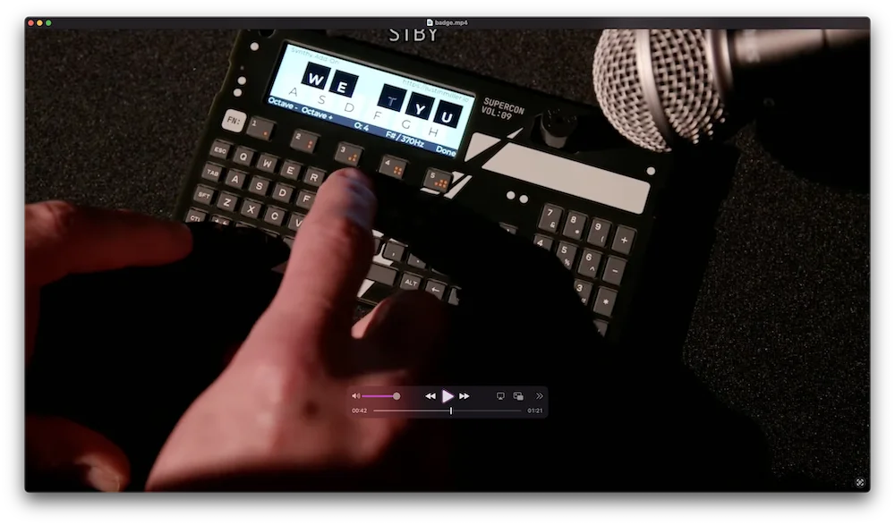

# Supercon 2025 徽章合成器

> 周日起床时，我有了一个很好的想法：使用 Supercon 徽章正面的 Shitty 标准附加接口，快速添加一些硬件，并编写一个图形化合成器键盘。我们有支持 PWM 的 GPIO、有屏幕、有键盘，而且 SAO 接口间距非常接近蜂鸣器的引脚间距，于是就产生了 *Synthy Add-On*。使用 MicroPython 编程。   

    
   
### 相关链接   
- [详细说明](https://justinmiller.io/posts/2025/12/01/supercon-2025-badge-hack/)   
- [代码](https://github.com/incanus/synthy-add-on)   
