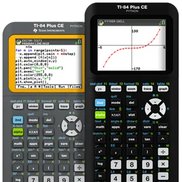

# TI-84 Plus CE 系列图形计算器

## 主要特点 
- 重量轻，但足够耐用，可以承受课堂上年复一年的要求 
- 以鲜艳的色彩绘制图表，以建立更快、更牢固的联系 
- 由 TI 可充电电池供电，一次充电可使用长达一个月 
- 无干扰（无蓝牙、Wi-Fi、互联网访问），让学生专注于学习 
- 随时随地编码 — 学生可以随时随地利用便携式编程的强大功能进行编码 
- 非常适合学生在任何学习环境中使用，无论是虚拟的还是面对面的 
- 按您编写的方式显示表达式、符号和分数 
 
 
### TI-84 Plus CE Python 版 

编码是数字时代的一种基本素养，学生理解并能够使用他们周围的技术非常重要。通过将 Python 版本添加到 TI-84 Plus CE 绘图系列中，学生可以学习使用他们在数学课上已经熟悉的专用、无干扰工具进行编程。 
Python 是:
- 易于学习和使用 
- 推荐给初学者和有经验的程序员 
- 能够为学生提供可应用于许多行业的真实经验 
- 世界上发展最快的编程语言之一 

## 链接
- [网站](https://education.ti.com/en/products/calculators/graphing-calculators/ti-84-plus-ce-python)
- [TI-84 Plus CE Python 图形计算器应用程序指南（英文）](https://education.ti.com/download/en/ed-tech/1424CF4F539A4DBB9145E2AA89F0FF54/6B54CFC1890744FEA88EC6B08AA204C3/AppAll_84PlusCEPY_EN.pdf) 
- [适用于 TI CE 系列图形计算器的 CE TI-Basic 编程指南（英文版）](https://education.ti.com/download/en/ed-tech/1424CF4F539A4DBB9145E2AA89F0FF54/B46510283B59436E8FD3DFC094A9E589/TI-ProgGuide_EN.pdf) 
- [TI-84 Plus 的 Python 编程 CE Python 图形计算器（英文版）](https://education.ti.com/download/en/ed-tech/1424CF4F539A4DBB9145E2AA89F0FF54/9AEBA7578B594B838FE7C04D58D4258F/TI-PyAppPrgG_v570_EN.pdf) 
- [TI-84 Plus CE 参考指南（英文版）](https://education.ti.com/download/en/ed-tech/1424CF4F539A4DBB9145E2AA89F0FF54/8DB4EE119C9C475DA0EAD61B98D1BA4B/GRefGuide_84PlusCE_EN.pdf) 
- [TI-84 Plus CE Python 图形计算器入门 （英文版）](https://education.ti.com/download/en/ed-tech/1424CF4F539A4DBB9145E2AA89F0FF54/2E06C849CD564304AD353029EAFEEC92/84PLCEPY_GSG_EN.pdf) 
 
