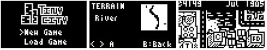

# TinyCity

TinyCity 是一款受《模拟城市》启发的城市模拟游戏，通过 MicroPython 运行在树莓派 RP2040。

在这个微型城市模拟中建造和管理一个不断发展的大都市，平衡区域和资源，达成里程碑以获得加成，并应对随机生成的灾难。

## 特色
* 三种地形可选，或者随机生成的地图
* 住宅、商业与工业分区
* 预算管理
* 人口增长与密度、电网、犯罪与污染
* 带有随机事件的灾难系统
* 里程碑与隐藏奖励
* 保存/加载功能
* 警察和消防站、发电厂、体育场等等！

项目网址：
* https://github.com/chrisdiana/TinyCity
