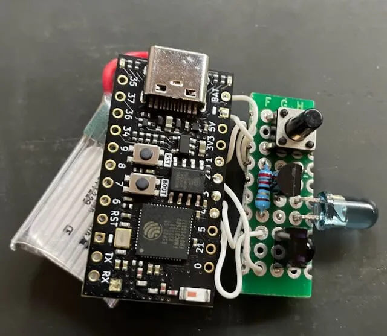

# TV-B-Gone 的 MicroPython 克隆

这是一个 TV-B-Gone 项目的 MicroPython 实现。TV-B-Gone（由 Mitch Altman 设计）是一种通用遥控器，可以关闭大多数电视机。不幸的是，现有的开源实现（针对 ATTiny 微控制器）代码库非常过时，并且无法与许多现代电视机兼容。该项目设计用于与 ESP32 微控制器和最新版本的 MicroPython（我使用了 v1.25.0）一起工作。我想使用 ESP32，因为它的 RMT 外设允许简单且控制良好的调制红外信号生成。

**支持的电视品牌**

* Samsung  三星
* LG
* TCL
* Hisense  海信
* Sony  索尼
* Vizio  菲利普
* Panasonic  松下
* Philips  飞利浦
* Sharp  锐利
* Toshiba  东芝
* Hitachi  日立
* ONN
* Mitsubishi  三菱

**项目网址**

- https://github.com/bikeNomad/micropython-tv-b-gone
