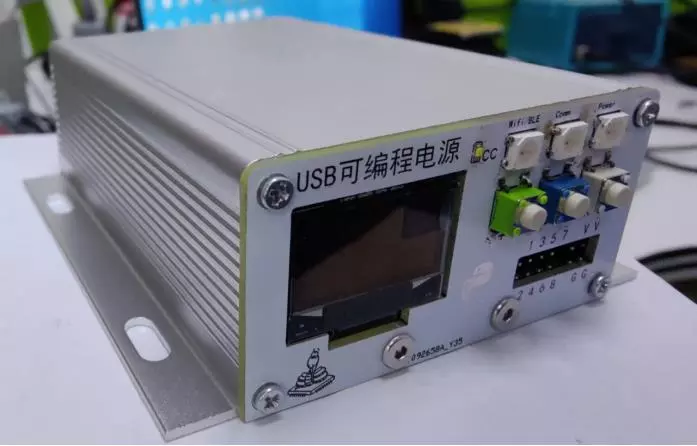

# USB 便携式可编程仪表

这是2022年得捷创新大赛的获奖作品。

## 功能介绍

USB 便携式可编程仪表的核心想法是给电子工程师和爱好者提供一系列低成本、便携式、支持网络、可以编程控制、开源的实用工具。多功能USB电源是其中的第一个，希望作为传统可调式稳压电源的补充。普通的可调电源虽然简单易用，但是也存在无法远程控制、不能记录数据、体积大、效率低、不方便携带、供电方式不灵活等缺点。而随着USB PD功能的普及，支持USB PD功能的充电器和移动电源越来越多，以及物联网时代新的要求，给了我们新的选择。

 

## 主要特点

* USB Type-C 供电，支持PD
* 支持升降压模式
* 可以通过USB、蓝牙、Wifi等多种方式控制，支持远程控制
* 支持用户二次编程开发
* 可以自动记录运行数据，并上传云端
* 硬件模功能块化设计，方便以后升级硬件和功能扩展
* 体积小巧，效率高
* 低成本
* 开源

## 主要芯片

* MCU: ESP32-S3-wroom
* Power: SC8721A
* PD: CH224K

## 开发工具

* EDA：立创EDA
* 软件：micropython

## 主要链接

* [作品说明](https://bbs.eeworld.com.cn/thread-1221743-1-1.html)
* [视频链接](https://training.eeworld.com.cn/video/34591)
* 仓库地址
	* [github](https://github.com/makediy/PPPS)
	* [gitee](https://gitee.com/makediy/ppps)
