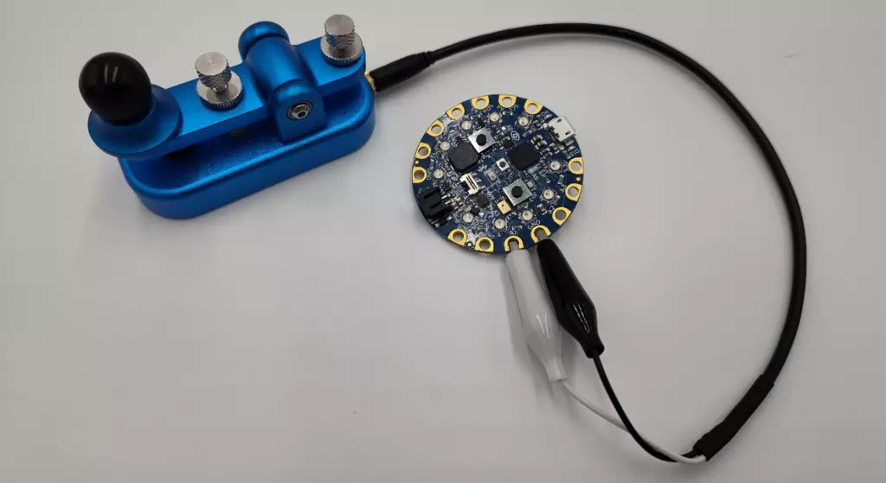

# USB 摩尔码键盘
使用 CircuitPython 编程，通过 USB 将摩尔斯电码发送到计算机。

TinyUSB 库支持 CircuitPython 的许多 USB 功能。这使得 CircuitPython 可以充当存储驱动器、CDC、HID、MIDI 等。从 10.3.0-α.3 版本开始，CircuitPython 增加了对 USB 音频类型的支持。本指南演示了如何使用 USB 麦克风功能生成音调，并将其输出到计算机或其他数字音频设备上。可以连接一个按键，以实时点击摩斯代码，并使用生成器函数自动将字符串转换为声音。

## 相关链接

- [完整说明](https://learn.adafruit.com/usb-morse-code-paddle-with-circuitpython?view=all)
- [github代码](https://github.com/adafruit/Adafruit_Learning_System_Guides/blob/main/CPB_Morse_Code_Paddle/code.py)
