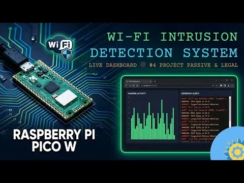

# 树莓派 Pico W：Wi-Fi 入侵检测系统（WIDS）

一款轻量级的硬件 Wi-Fi 入侵检测系统（WIDS），专为树莓派 Pico W 设计。该系统监控本地射频环境，检测常见无线攻击，提供通过任何网页浏览器访问的实时安全仪表盘。

    

## 主要特点

- **恶意 TWIN 检测**：识别广播相同SSID的多个接入点（AP），这是网络钓鱼攻击的常见迹象。
- **RSSI异常跟踪**：检测可能表明存在局部“中间人”攻击企图的显著信号强度峰值。
- **信道泛洪分析**：监控射频（RF）拥塞情况；若单个信道上有超过6个网络同时占用，则发出警报，预示可能存在拒绝服务（DoS）或干扰问题。
- **实时仪表板**：一个直接由Pico W提供的、具有移动端响应式设计且采用深色主题的HTML/JavaScript仪表板。
- **自动后台扫描**：每5秒执行一次环境审计，且不会中断Web服务器。   
   
## 项目网址：   
[https://github.com/flatmarstheory/Wi-Fi-Intrusion-Detection-System](https://github.com/flatmarstheory/Wi-Fi-Intrusion-Detection-System)  
