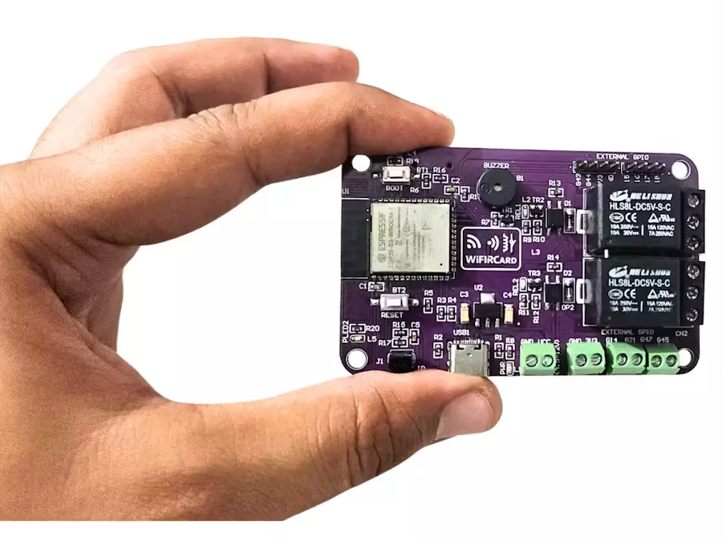

# WiFIRCard – 使用 ESP32-S3、IR 和继电器实现智能家居自动化

WiFIRCard：一张信用卡大小的 ESP32-S3 主板，具备 Wi-Fi、红外线和双继电器功能——智能、多功能，非常适合物联网和自动化项目。

https://www.hackster.io/CarstenJanmy/wifircard-smart-home-automation-with-esp32-s3-ir-relays-d9c2a1