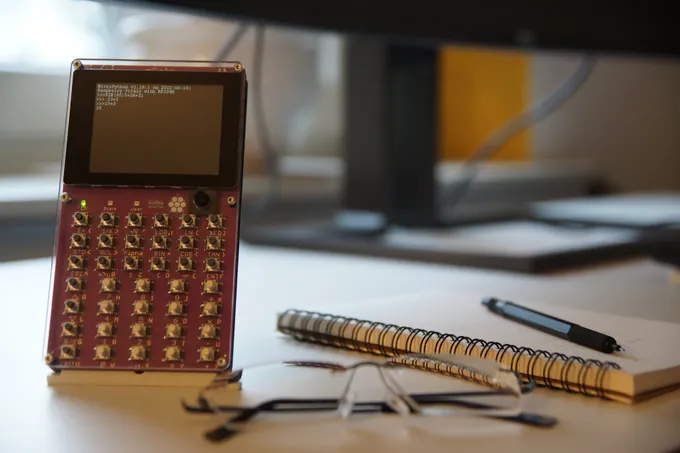
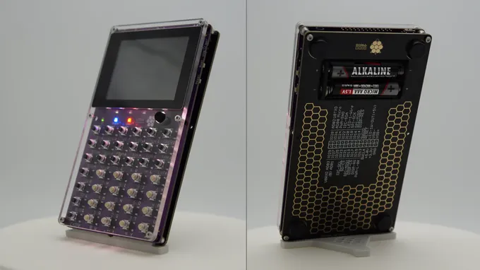

# πCalc 计算器

πCalc 是一个基于 Raspberry PI Pico RP2040 处理器，并由 MicroPython/CircuitPython 驱动的计算器。πCalc 不仅仅是一个简单的计算器，它是一个用于 Python 创意编程的平台。不仅可以执行基本算术运算，还可以将您的独特想法变为现实。提升数学和 Python 技能，以有趣和互动的方式解决复杂任务。

高级开发者也可以利用 πCalc 的 Raspberry PI Pico 处理器，用 C、C++或汇编语言运行任何想象得到的应用，将计算器变成电子鼓或游戏机。πCalc 是创客们的多功能工具，只需几行代码即可轻松学习如何编程 I2C 和 SPI 设备。

链接：
- [网站](https://www.kickstarter.com/projects/shellbrix/calc)
- [kickstarter众筹](https://www.kickstarter.com/projects/shellbrix/calc)
