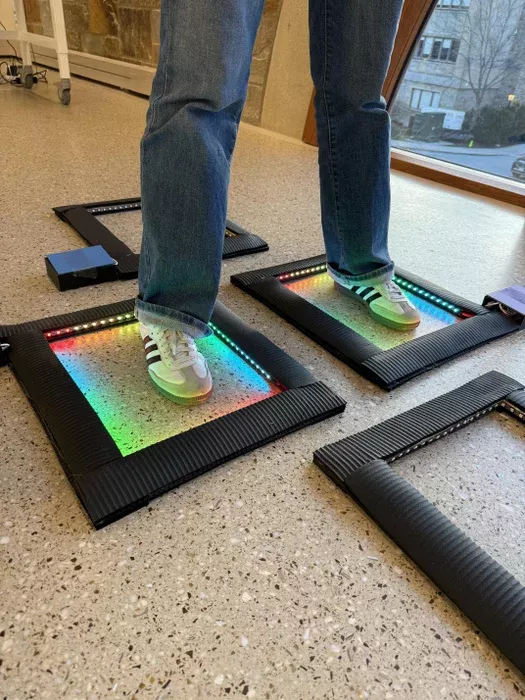

# 互动跳房子

这个跳房子游戏提升到了一个新的层次！每次踩到一个跳房子方格，LED灯就会根据传感器的反应亮起。可以随意排列方格，并挑战同伴跳过特定的图案！

使用 Pi Pico 控制 ws2812 灯带，用 circuitpython 编程。

## 相关链接：
- [Instructables 说明](https://www.instructables.com/Interactive-Hopscotch/)
- [参考代码](https://content.instructables.com/FHA/8HO1/MJ5TUANI/FHA8HO1MJ5TUANI.py)
