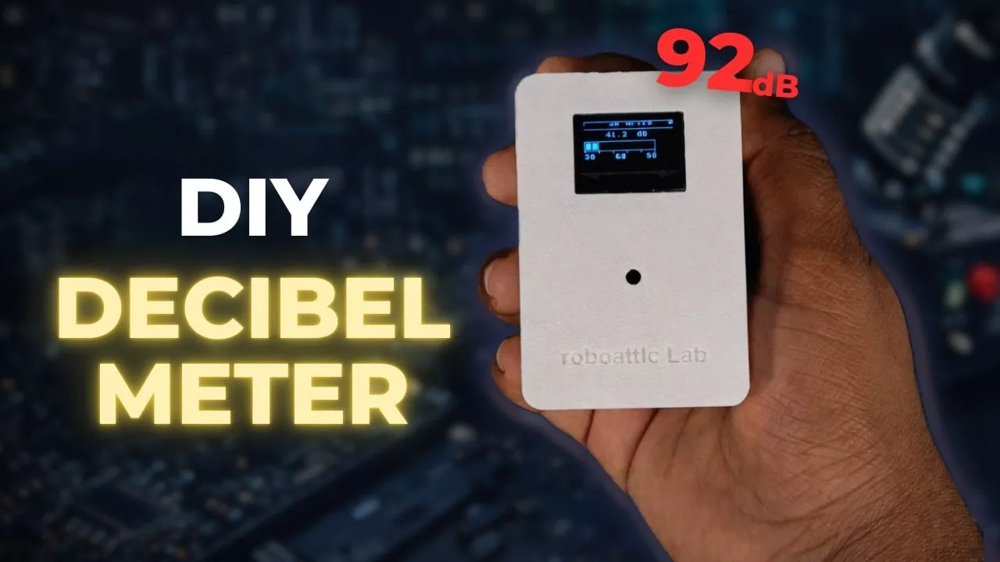

# 便携式分贝仪

使用树莓派Pico和高精度的 INMP441 I2S MEMS 麦克风制造了便携式分贝仪。该设备实时测量声音级别，并在OLED屏幕上显示，采用电池供电设计，完全独立运行。

**本项目涵盖:**

* 实时声位测量(dB)
* I2S 麦克风接口与树莓派 Pico 接口
* OLED可视化
* 使用 fuscument360 定制的 3D 打印外壳
* 基于PCB的最终组装,实现专业完成

这是一个实用的电子+嵌入式系统项目,非常适合使用树莓派Pico进行物联网、环境监测、噪声分析以及学习MicroPython。

## 相关链接

- [项目说明](https://www.instructables.com/I-Built-a-Portable-Decibel-Meter-Using-Raspberry-P/)
- [项目仓库](https://github.com/ShahbazCoder1/Portable-Decibel-Meter-Using-Raspberry-Pi-Pico-and-Micro-Python)
