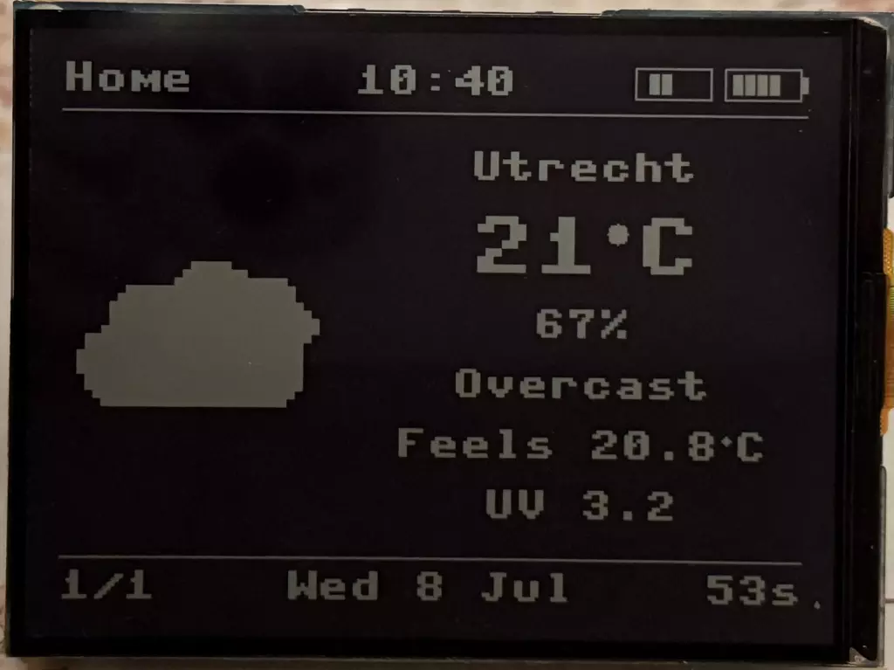

# 在反显LCD上构建天气主屏幕

这是一个周末的练习，让ST7305驱动程序工作，连接WiFi，从Open Meteo获取实时天气，并在周日之前在显示器上显示一些有用的东西。

- 完整说明：https://developer-service.blog/building-a-weather-home-screen-on-a-reflective-lcd-micropython-esp32-s3/
- 代码仓库：https://github.com/nunombispo/waveshare-rlcd-weather-article?ref=developer-service.blog
