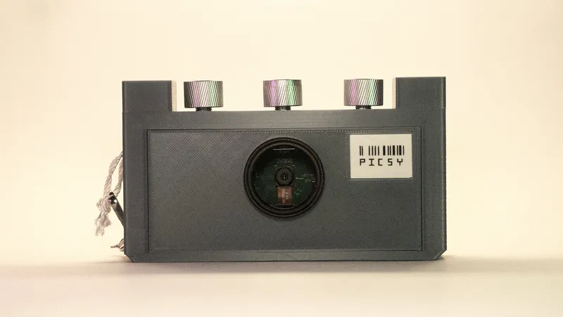

# 基于 ESP32 的像素艺术摄像头

PICSY 是一个基于 ESP32 的像素艺术相机，它直接将带有色彩索引的像素艺术 PNG 直接拍摄到 SD 卡上。

先从 github 下载文件，然后更新固件，将 `/main/micropython-bin` 刷入 esp32，最后复制 `ubuf2png.py` 到 ESP32-CAM 上。

**仓库地址**：

https://github.com/Jana-Marie/PICSY
