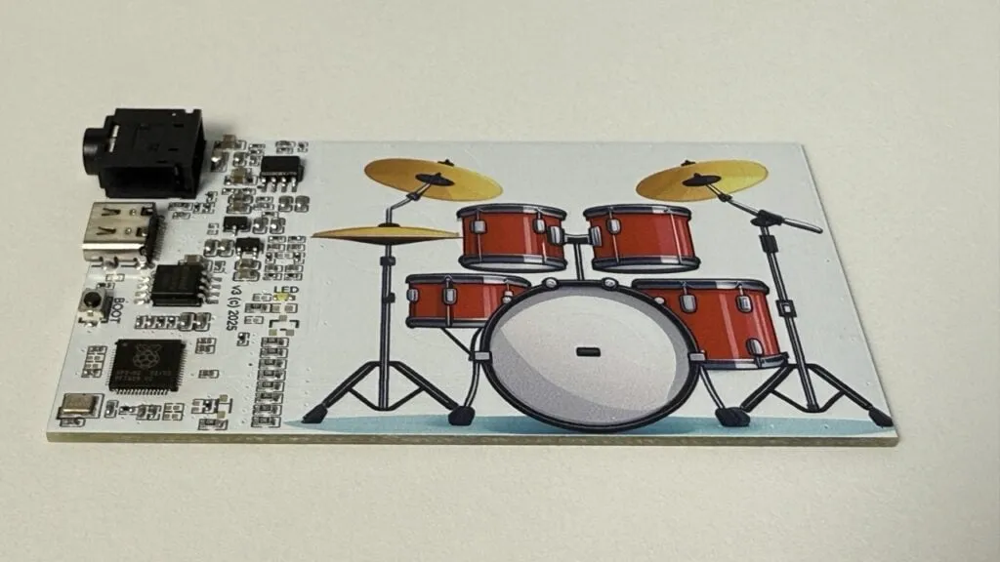

# 基于 RP2040 的电子鼓名片

https://www.raspberrypi.com/news/electronic-drum-business-cards-built-on-rp2040/ 

想在社交活动中将你的名字深深铭刻在某人的记忆中吗？那谢尔盖·安东诺维奇就帮你搞定了。这位嵌入式系统工程师将这张古老的名片重新发明，将其变成了一套可演奏的电子鼓 — 我们敢打赌它不会被遗忘在某人的口袋里。

使用 CircuitPython 编程，点击卡片上鼓的图像（RP2040 的触摸按键）控制发声，声音通过RP2040的两个PWM通道输出。

项目链接：
https://github.com/serganto/rp-drumcard 
