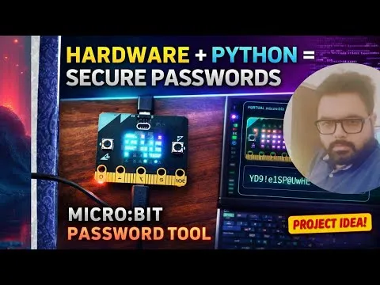

# 基于硬件的密码库与传感器仿真

该项目将 BBC micro:bit 转化为硬件辅助的熵源，用于生成加密强度高的密码。该项目配备了一个实时“数字孪生”桌面应用程序，该应用程序能够可视化micro:bit传感器传来的实时遥测数据，从而在物理随机性与数字安全之间架起了一座视觉桥梁。

## 🚀主要特点

* **熵收集**：对加速度计（X、Y、Z）和麦克风级别进行采样，以生成不可预测的随机种子。
* **数字孪生可视化**：一个动画化的Tkinter画布会随着物理设备的移动而同步抖动和发光。
* **实时遥测**：将原始传感器数据通过UART（波特率为115200）实时传输至专用仪表板。
* **电影式揭秘**：在锁定最终密码之前，会有一段“老虎机”动画在角色之间循环播放。
* **安全性分析**：基于密码长度和字符类型，自动评估密码强度（从弱到强）。

## 🛠️ 仓库结构

* MB.py：针对micro:bit硬件的MicroPython脚本。
* Client.py：用于可视化的Python Tkinter桌面应用程序。
* requirements.txt：Python 依赖项（pyserial、pyperclip）。

项目网址：
https://github.com/flatmarstheory/Hardware-Based-Password-Generator

