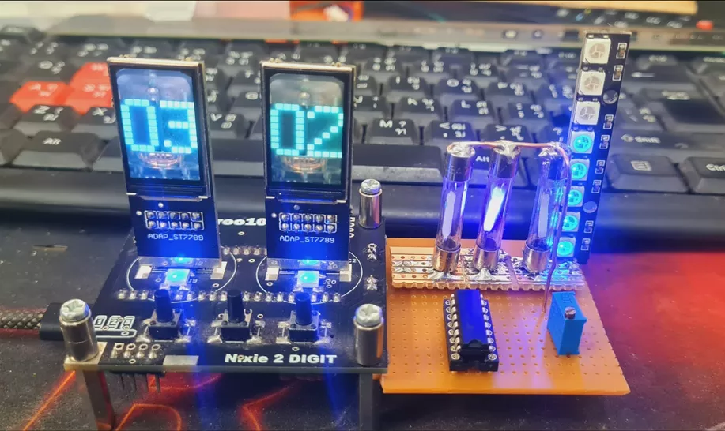

# 复古未来混合风格时钟

一款融合双液晶、三位灯丝LED和WS2812效果的复古未来式时钟 —— 融合了赛博朋克风格和蒸汽朋克温暖感。系统用树莓派 Pico 2+circuitpyhon开发。

    

复古-未来风格混合时钟通过三个同步图层来可视化时间，将数字显示屏、照明和动画效果结合成一体。   

两个 ST7789 TFT屏幕采用定制的 Nixie 风格数字，呈现简洁且高对比度的复古效果，同时保持足够的亮度和清晰度。   

通过 ULN2003 驱动阵列驱动的LED灯丝，使用二进制输出显示秒。这种纯粹的物理显示方式，将逻辑二进制计数转化为生动的视觉元素，增强了机械与计算之间的情感交融。   

对于时间的流动，WS2812 LED灯带充当了一个动态的“秒针”。每个发光的像素都代表着流逝的秒数，从0到10不断循环，营造出一种持续的运动感和节奏感。   

所有三个显示层均由运行CircuitPython的Raspberry Pi Pico 2和DS3231实时时钟模块同步，确保每个视觉元素都能以精确的时间同步更新。   

这些分层展示共同将时间从简单的数字数据转化为生动的视觉表现——它不仅仅是供人阅读的内容，更是能在空间中动态展现和演变的东西。   

- [项目说明](https://www.instructables.com/Retro-Futuristic-Hybrid-Clock/%20)   
- [github 代码](https://github.com/YakrooThai/Contests/blob/main/Instructables/Retro-Futuristic-Clock.py)   
