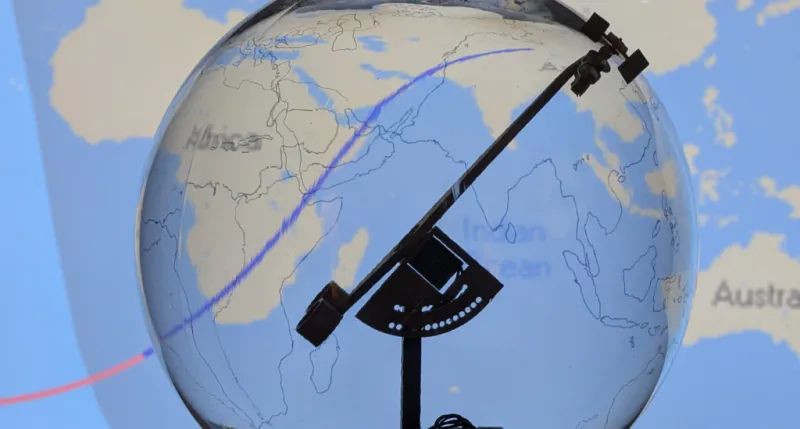

# 实时国际空间站追踪器

Orbigator 是一款开源的物理卫星追踪器，将复杂的轨道力学变成桌边的伴侣。它由树莓派 Pico 2 和精密 DYNAMIXEL 伺服驱动，实时物理指向国际空间站（或任何卫星），零漂移。

与传统使用静态球体（每圈需要解线）的跟踪器不同，Orbigator 采用旋转球体。这使得多圈跟踪能够平稳、连续，无需重置或“松开”。

## 相关链接

- [hackaday 说明](https://hackaday.com/2026/03/09/real-time-iss-tracker-shows-off-the-goods/)
- [github 代码仓库](https://github.com/wyolum/orbigator)
- [adafruit 博客](https://blog.adafruit.com/2026/03/09/orbigator-is-an-open-source-physical-satellite-tracker/)
