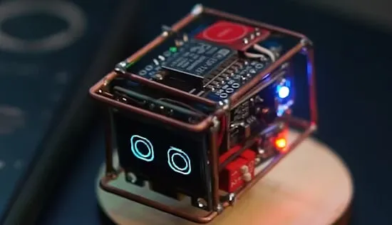

# 小巧的桌面机器人

用可编程的迷你糯米团机器人来缓解办公桌压力吧，它会跳舞、对触摸做出反应，还能为你的工作空间增添趣味。

这个低成本的小机器人可以自己动手制作，它能随着音乐跳舞，当你抚摸它时会有所反应，并通过面部表情展现出个性。只需几个现成的组件、一个电烙铁和几个小时的空闲时间，你就能拥有自己的迷你机器人。

机器人基于 Wemos D1 Mini ESP8266 开发板构建。它连接到一个小型液晶显示屏，声音传感器和触控传感器模块支持用户互动，SG90 伺服则让迷你机器人能随着音乐跳舞。502020 锂聚合物电池、升压转换器、电压调节器和开关，构成了硬件的其余部分。这些部件被热熔胶粘在一起，然后固定在由粗铜丝制成的框架上。伺服装置安装在一个圆形木质底座上，为机器人提供一个稳定的“舞蹈平台”。

D1 Mini 板可通过 Arduino IDE 或 MicroPython 编程，实现更多功能。

**完整说明**：

https://www.hackster.io/news/this-tiny-robot-wants-to-live-on-your-desk-ed7931a13f5a
