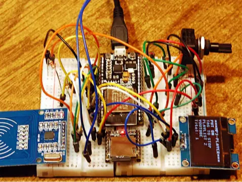
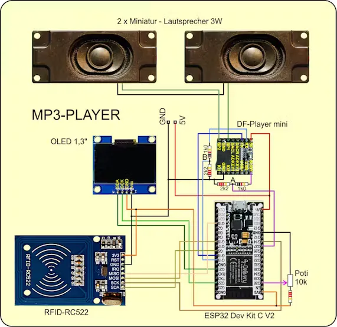

# 带 RFID 的 MP3 播放器

使用 micropython 编程，用 ESP32 控制 DFPlayer Mini（[mp3player.py](http://grzesina.de/az/mp3/mp3player.py)）、RFID（[mfrc522.py](http://grzesina.de/az/mp3/mfrc522.py)）、OLED（[sh1106.py](http://grzesina.de/az/mp3/sh1106.py)）。

[Hackster 项目说明](https://www.hackster.io/az-delivery/mp3-player-with-rfid-c3dfca)
