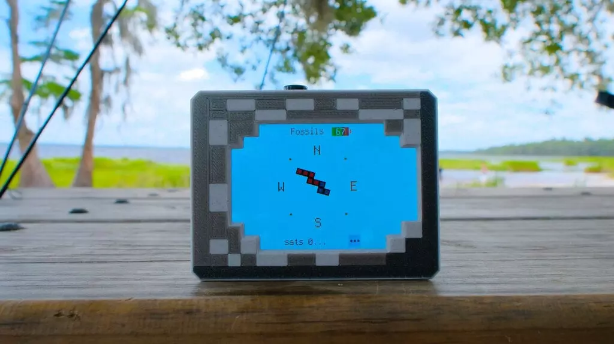

# 我的世界 GPS 指南针

构建一个受《我的世界》游戏启发的 GPS 指南针。

这款指南针的灵感来自夏令营探险，它可以保存和加载航点，让您始终知道回去的路。

允许通过菜单选择以前保存的位置，并在户外探索时指向它们。

此项目使用 Adafruit Feather RP2350 开发板，以及迷你GPS模块和陀螺仪。它们协同工作，感知地球磁场并收集GPS的位置。传感器校准在设备上正确处理，无需计算机。

使用 CircuitPython 编程，允许重命名预设航路点，设置本地磁偏角，并在英里和公里之间切换。

🔗链接：

- https://learn.adafruit.com/minecraft-gps-compass?view=all
