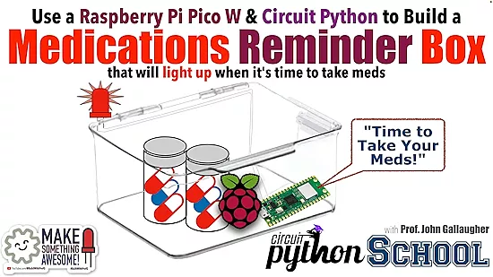

# 服药提醒盒子

使用 Pico W 或 Pico2 W 制作的服药提醒盒子，在需要服用处方药或补充药剂时会点亮，用 circuitpython 编程。

使用的库：
* circuitpython_schedule.mpy (from the community bundle)
* adafruit_datetime.mpy
* adafruit_ntp.mpy

项目仓库：

https://github.com/gallaugher/pico-medications-reminder-box
