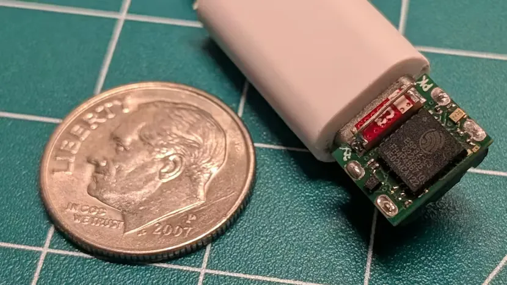
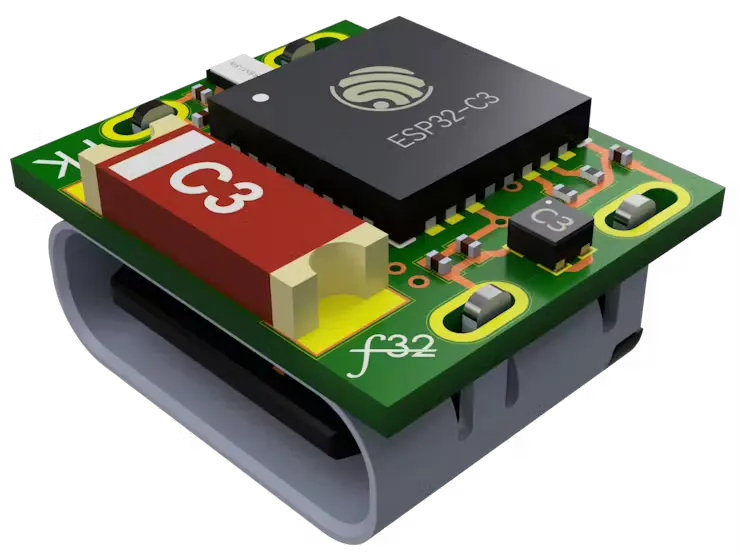

# 比一角硬币还小的 ESP32 开发板

极其小巧的 ESP32-C3 开发板可以安装在 USB-C 接口的背面，用于托管网页应用或控制简单电路。

为了尽量减少占地面积，PCB 直接安装在 USB-C 连接器上。PCB 本身只装有最基本的元件——一颗 ESP32-C3 芯片，以及必要的辅助元件，如电容和电阻。只暴露了一个 GPIO 引脚，导致与外部设备几乎无法互动。

[github 设计文件](https://github.com/PegorK/f32)
