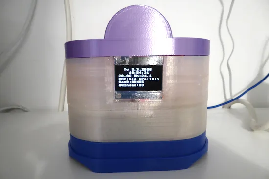

# 空气质量检测

空气质量传感器V3现已测试并运行。它有一个3D打印的外壳，使用物联网/MQTT将数据发送到数据库，并在显示屏上显示。使用MicroPython 在 ESP32 上编程。

- [Codeberg](https://codeberg.org/hiltsu/micropython-for-embedded-systems/src/branch/main/Airquality/esp32-oled-mhz19b-pms9103m-bme680/readme.md)
