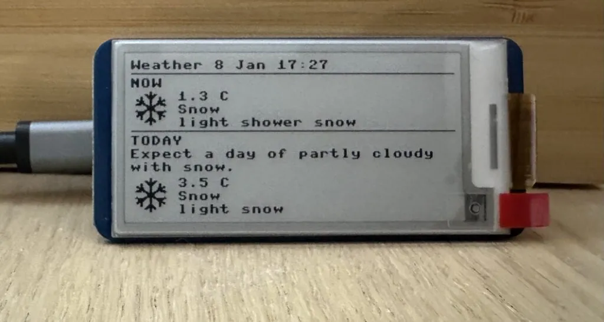

# 简易天气仪表盘

这是[树莓派官方博客](https://www.raspberrypi.com/news/raspberry-pi-pico-projects/)推荐的一个项目。

一个简单的 Pi Pico 天气仪表盘。从 OpenWeather 获取天气数据，并显示在电子纸显示屏上。

## 硬件

- Raspberry Pi Pico W
- [Waveshare 2.13inch e-Paper HAT](https://www.waveshare.com/wiki/2.13inch_e-Paper_HAT)

## 依赖

- MicroPython
- [OpenWeather](https://openweathermap.org/) API key

## 设置

- 先在 Pico W 上安装了 MicroPython。
- 克隆仓库。
- 复制 config.txt.example 到 config.txt 并填写所需值。

## 部署并运行

把根目录里的 Python 文件和 config.txt 文件复制到 Pico W。

## 相关链接

- [github 仓库](https://github.com/outofcoffee/pico-weather)
