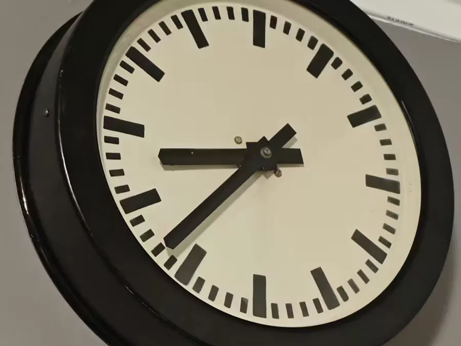
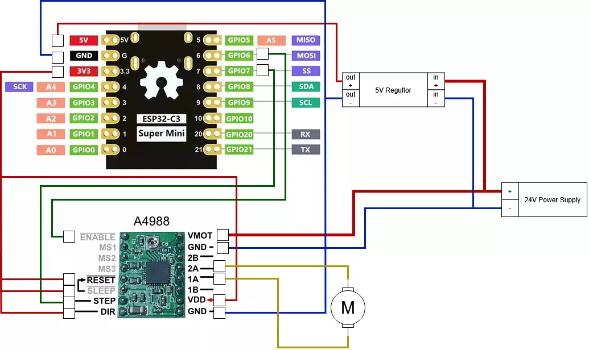

# 老式火车站时钟

使用 ESP32-C3 和 Micropython，以及 A4988 步进驱动器运行复古式火车站时钟，并连接 WiFi 同步时间。

## 原理图

## 相关链接
- [项目说明](https://www.hackster.io/piotrtopa/old-train-station-clock-esp32-stepper-driver-hack-1cb319)
- [代码](https://github.com/PiotrTopa/OldTrainStationClock/)
