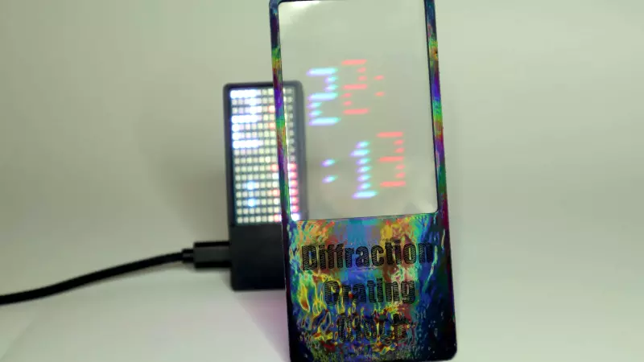

# 衍射光栅钟
时钟由一个RGB LED矩阵组成,其中每小时的两位数字都以红色和蓝色叠加,即由两位数共享的LED以紫色点亮。同样,下方显示的分钟数也叠加了。当衍射光栅放置在LED矩阵前面时,红色和蓝色的圆点会因不同角度的不同而被分开。这样时间就变得可读。
 
 

## 相关链接

- [instructables](https://www.instructables.com/Diffraction-Grating-Clock/)
- [hackaday](https://hackaday.com/2026/06/03/a-diffraction-grating-makes-this-clock-readable/)
- [github 仓库](https://github.com/vonsivers/DiffractionGratingClock)
