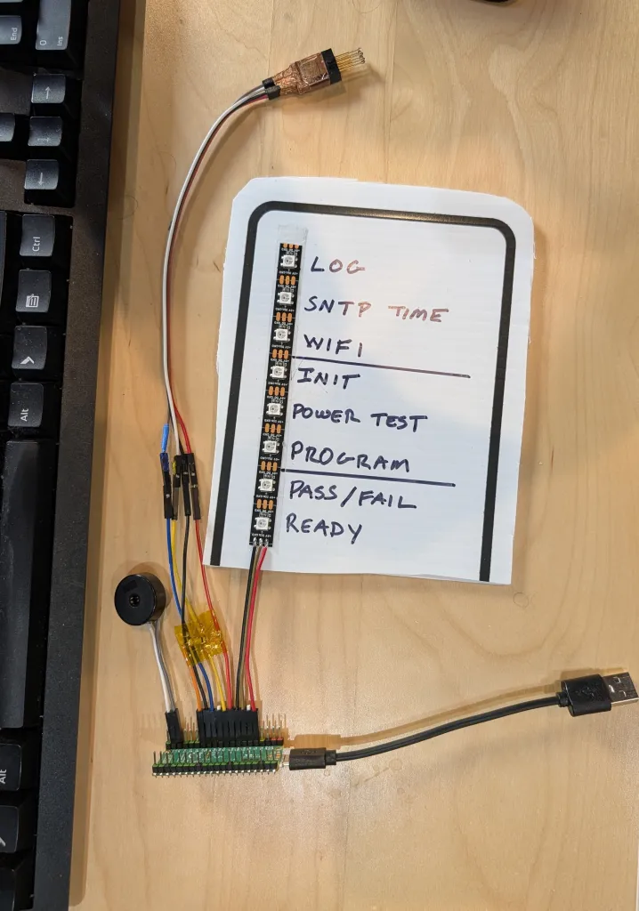

# 超高速 MSP430 编程器

超高速独立 MSP430 编程器，通过 Spy-Bi-Wire（SBW），基于运行 MicroPython 的树莓派 Pico/2/W 构建。速度比 TI 的 MSP-FET 快 100 倍。

* 比TI的MSP-FET编程器快100倍
* 基于广泛可用的树莓派 Pico (低至4美元)
* 支持独立操作(无需计算机)
* 支持无头操作(无需屏幕或键盘)
* 体积小巧
* 开源
* 高级部分用 Python 写的，所以很容易根据你的需求调整
* 非常可靠

## 相关链接

* [说明](https://wp.josh.com/2026/04/19/an-ultrafast-msp430-sbw-programmer-for-4/)
* [github 仓库](https://github.com/bigjosh/pi-pico-sbw)
